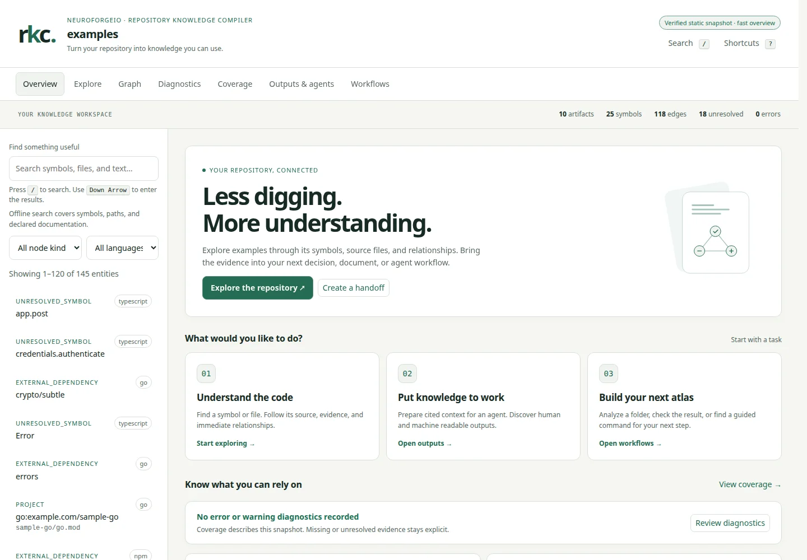

# Repository Knowledge Compiler (RKC)

**Turn folders and repositories into searchable knowledge for people, code, and agents.**

[](https://github.com/neuroforge-io/RKC/actions/workflows/ci.yml)
[](LICENSE)

RKC compiles code, documentation, and exported wiki folders into an **atlas**:
a portable snapshot of files, symbols, relationships, evidence, and coverage.
Explore it in a local browser, create cited context for an agent, or use its
structured outputs in your own tools. The default workflow needs no model,
Go toolchain, Python installation, or database server when using a portable download.

Use RKC to get oriented in an unfamiliar project, document how a system fits
together, investigate a change, or prepare a source collection for downstream
knowledge workflows. Facts stay linked to evidence; missing and unresolved
information stays visible.



*Actual static workbench view of RKC’s public examples. The local app also
provides folder and GitHub source selection.*

## Install and open

The installers below use the latest portable assets on the
[release page](https://github.com/neuroforge-io/RKC/releases), where each download
has matching native test receipts. For an unreleased checkout, or if no portable
assets are listed, [build from source](docs/INSTALL.md#build-from-source).

**Linux / macOS — Terminal**

```sh
curl -fsSL https://github.com/neuroforge-io/RKC/releases/latest/download/install-release.sh | sh
export PATH="$HOME/.local/bin:$PATH"
```

**Windows — PowerShell**

```powershell
irm https://github.com/neuroforge-io/RKC/releases/latest/download/install-release.ps1 | iex
```

Then open the local app:

```sh
rkc gui
```

Choose **Local folder** → **Choose folder** → **Compile folder**, or search
under **GitHub repository** and select **Compile repository**. Public GitHub
search needs no account connection. Private repositories use an optional
personal access token held for the local server session. The verified atlas
opens in the same window; **Change source** starts the next one.

Portable targets are Linux, macOS 12+, and Windows 10+ on Intel/AMD 64-bit or
ARM64. Linux compilation and the protected workbench require a reachable
user-systemd manager with delegated cgroup v2 controllers. macOS and Windows
run built-in compilation without claiming Linux’s kernel resource limits.
The POSIX installer needs `curl`, `unzip`, and `sha256sum` or `shasum`; Windows
uses PowerShell 5.1 or newer. No administrator install is needed.

See [installation and platform details](docs/INSTALL.md), then follow the
[quickstart](docs/QUICKSTART.md). Qualification applies only to the exact
platforms and archives covered by published native test receipts; cross-built
assets alone are not proof of native execution.

## What you can do

| Goal | In the workbench | Useful output |
| --- | --- | --- |
| Understand a project | Search, Explore, and Graph | Cited symbols, source excerpts, relationships |
| Check what is known | Diagnostics and Coverage | Explicit errors, unresolved links, auditable counts |
| Give an agent useful context | Outputs & agents | Bounded JSON or Markdown context packets |
| Document or share a source | Workflows and generated exports | Markdown docs, static site, NotebookLM packs |
| Combine processed sources | Knowledge-pack workflow | Verified, provenance-preserving JSON/JSONL packs |
| Build your own integration | CLI, local HTTP, MCP, Go packages | Versioned contracts and machine-readable records |

The browser is responsive and keyboard accessible. Large entity, search, and
diagnostic lists use bounded pages, with earlier results still reachable.
Local-folder compilation stays local; GitHub acquisition connects to GitHub.
Default compilation does not run repository code or download a model.

## Use the same evidence from code

Replace `./my-project` with your source folder:

```sh
rkc quickstart ./my-project
rkc query --dir ./my-project/.rkc "authentication"
rkc context --dir ./my-project/.rkc --format markdown "How does authentication work?"
rkc capabilities
```

Serve an existing atlas through the local read API:

```sh
rkc serve --dir ./my-project/.rkc --addr 127.0.0.1:8787
```

Or configure an MCP client to launch the installed stdio server:

```sh
rkc-mcp --dir ./my-project/.rkc
```

Combine compiled atlas folders without a model:

```sh
rkc knowledge build --out ./knowledge-pack ./atlas-a ./atlas-b
rkc knowledge verify --dir ./knowledge-pack --json
```

[Workbench and integrations](docs/WORKBENCH_AND_INTEGRATIONS.md) covers the
GUI, CLI, HTTP, and agent workflows. See the [HTTP contract](api/openapi.yaml),
[knowledge-pack format](docs/KNOWLEDGE_PACKS.md), and
[plugin SDK](docs/plugin-sdk.md) to extend RKC.

## What an atlas contains

A default folder compilation writes `<folder>/.rkc` and retains immutable
snapshots under `<folder>/.rkc-state`:

```text
.rkc/
├── bundle.json          Canonical records and evidence
├── coverage.json        Coverage, diagnostics, and accounting
├── rkc.manifest.json    Snapshot identity and provenance
├── graph/               Structured JSONL records
├── docs/                Linked Markdown documentation
├── normalized/          Secret-redacted source envelopes
├── notebooklm/          Ordered Markdown packs and an upload guide
├── integrations/        SARIF, GraphML, Mermaid, and CSV
├── search/              Local search index
└── site/                Portable static workbench
```

Available detail depends on the admitted source and analysis profile.
[SCIP imports](docs/SCIP_SEMANTIC_ADAPTERS.md) add compiler-produced semantics
across languages. Source text remains untrusted data, even when cited.
Knowledge packs preserve source provenance and rights information; they do
not grant new rights to redistribute or train on the underlying material.

## Scope and trust

RKC is a standalone open-source project. It does not require a NeuroForgeIO
service. Static atlases and the normal read API do not execute jobs; the local
workbench uses an authenticated session with the invoking user’s filesystem
authority. It is intended for a trusted local user, not public multi-tenant hosting.

The deterministic workflow works without AI. Model execution is optional and
subject to separate qualification; no generation model is bundled or selected
as a qualified default. Python workers, external indexers, and other helper
processes have separate requirements and are not silently enabled by a scan.

For exact capability boundaries, see [implementation status](docs/IMPLEMENTATION_STATUS.md),
[security](docs/SECURITY_MODEL.md), [Linux resource controls and operations](docs/OPERATIONS.md),
and [model qualification](docs/MODEL_SELECTION.md).

## Develop and contribute

Start with the [development quickstart](docs/QUICKSTART.md#2-development-prerequisites),
[architecture](docs/ARCHITECTURE.md), and [data model](docs/data-model.md).
The [release validation guide](docs/RELEASE_VALIDATION.md) describes verification
and reproducibility gates. [RKC’s self-catalogue](docs/SELF_CATALOGUE.md)
shows how the project compiles its own committed source without recursively
ingesting earlier outputs.

## License

Copyright 2026 NeuroForgeIO and RKC contributors. NeuroForgeIO publishes and
maintains RKC under the [Apache License, Version 2.0](LICENSE). Commercial use
and derivative works are welcome under that license. Redistributions must meet
its applicable license, changed-file notice, attribution, and [NOTICE](NOTICE)
obligations. Third-party code, indexers, plugins, models, and source content
retain their own ownership and terms; see [third-party notices](THIRD_PARTY_NOTICES.md)
and [branding and attribution](docs/BRANDING_AND_ATTRIBUTION.md).

---
_RKC is open source, published and maintained by **NeuroForgeIO**, under the
**Apache License, Version 2.0**. Copyright 2026 NeuroForgeIO and RKC
contributors. Redistributed
works must preserve applicable license and `NOTICE` terms. Third-party materials
retain their own licenses and ownership._
