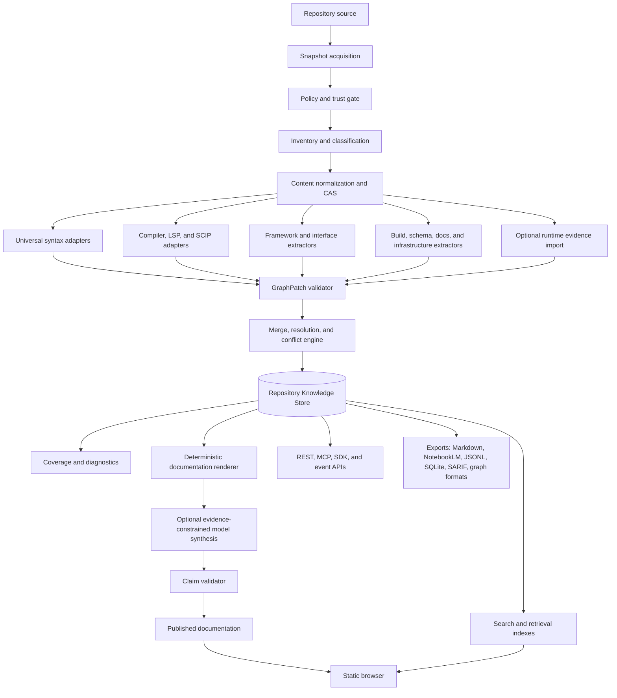

# Repository Knowledge Compiler
## Commercial-production implementation plan and open-source architecture

**Working abbreviation:** RKC  
**Document status:** Build specification  
**Reference schema version:** `0.1.0`  
**Target core license:** Apache-2.0  
**Baseline date:** 2026-07-21

---

## 0. Executive decision

Build RKC as a **deterministic repository compiler with an optional evidence-constrained language-model layer**.

The deterministic system owns:

- complete inventory accounting;
- file classification and normalization;
- symbol extraction;
- API, CLI, configuration, schema, build, test, and deployment surface extraction;
- graph construction;
- provenance;
- coverage measurement;
- change detection;
- validation;
- export;
- search indexes.

The model layer may:

- rewrite structured facts into readable prose;
- summarize a bounded graph neighborhood;
- explain a validated execution path;
- identify likely documentation gaps;
- answer questions from retrieved evidence packets.

The model layer may not be the authority for:

- whether a file exists;
- whether a symbol exists;
- a signature or argument list;
- a resolved definition or reference;
- public API inventory;
- completeness;
- side effects without evidence;
- test coverage;
- relationship identity;
- source citations.

This separation is the product's central safety and quality property. Most code-wiki systems start with prose and later attempt to recover truth. RKC starts with truth records and renders prose from them. Reversing that order is how software documentation becomes decorative fog.

---

## 1. Product definition

RKC consumes an immutable or working repository snapshot and produces a versioned, queryable **Repository Knowledge Representation** containing:

1. an explicit account of every encountered artifact;
2. a language-neutral graph of code and non-code entities;
3. evidence for every entity, edge, and generated claim;
4. deterministic documentation records;
5. optional model-authored explanations that pass structural validation;
6. lexical, structural, and optional semantic search indexes;
7. multiple portable exports;
8. a static or daemon-backed modern browser;
9. machine-readable quality and uncertainty reports;
10. a semantic diff between snapshots.

### 1.1 Primary use cases

- New developer onboarding.
- Architecture recovery for inherited or poorly documented systems.
- Public API and SDK documentation.
- Internal service catalog generation.
- Configuration and environment-variable inventory.
- Database and message-flow lineage.
- Change impact analysis.
- Test-to-code traceability.
- Documentation drift detection.
- Security review and attack-surface mapping.
- M&A technical due diligence.
- Regulated-system evidence packs.
- Repository-grounded assistants.
- NotebookLM and other retrieval-system preparation.
- CI policy enforcement.
- Offline browsing of sensitive repositories.

### 1.2 Explicit non-goals

RKC does not claim to:

- prove arbitrary program behavior;
- replace compilers, language servers, debuggers, profilers, or security analyzers;
- execute untrusted build systems by default;
- infer undocumented business intent with certainty;
- guarantee runtime call-graph completeness for reflective or generated systems;
- silently convert uncertainty into a confident paragraph;
- require a model to produce a useful result.

### 1.3 Definition of completeness

RKC uses **auditable completeness**, not metaphysical completeness.

A snapshot can prove that:

- every path encountered was recorded or explicitly excluded;
- every supported parser-discovered symbol has a node;
- every declared argument and return annotation captured by the parser is represented;
- every public surface identified by enabled extractors has documentation;
- every relationship records its resolution class;
- every unresolved relationship is counted;
- every generated claim has evidence or is rejected;
- every result identifies the repository state, configuration, plugin set, and toolchain used.

RKC cannot universally prove that it has discovered every behavior that may emerge from runtime reflection, generated code, external systems, environment-specific branches, native extensions, dynamic loading, metaprogramming, or arbitrary code execution. The system reports those boundaries rather than placing a tasteful rug over them.

---

## 2. Design laws

### 2.1 Determinism before eloquence

For fixed repository bytes, configuration, schema, plugin versions, and toolchain inputs, all non-model outputs must be byte-for-byte reproducible except fields explicitly declared volatile. Volatile fields are excluded from deterministic digests.

### 2.2 Evidence is data, not decoration

Every node, edge, document section, and model-authored claim links to one or more evidence records. A citation is not a path printed at the bottom of a page; it is a typed relation to a source range, tool run, runtime observation, specification, or user-approved assertion.

### 2.3 Nothing disappears silently

Files, directories, symlinks, submodules, generated outputs, vendored code, binaries, archives, oversized files, unreadable files, malformed source, and unsupported languages are all recorded. Policy may exclude them from deeper analysis, but exclusion itself becomes data.

### 2.4 One graph, many confidence classes

Declared, compiler-resolved, syntax-inferred, runtime-observed, documentation-asserted, model-inferred, and unresolved relationships coexist but remain distinguishable.

### 2.5 Local-first, server-capable

The same domain model and pipeline run as:

- one local executable;
- a local daemon;
- a CI job;
- an isolated worker in a distributed service;
- an embedded library;
- an MCP server;
- a static export producer.

### 2.6 Safe by default

Repository content is hostile input. Default analysis does not run project build scripts, package lifecycle hooks, arbitrary binaries, or network requests. Capabilities are denied unless granted.

### 2.7 Extension through contracts

Plugins return versioned graph patches. They do not receive direct database handles and cannot mutate core tables. This preserves validation, migrations, caching, auditability, and the faint possibility of sleeping at night.

### 2.8 Graceful degradation

A failed semantic indexer must not erase the valid inventory and syntax graph. Each stage commits independently, diagnostics remain visible, and the snapshot records degraded capability.

---

## 3. Deployment profiles

### 3.1 `local-static`

Purpose: offline analysis and portable browsing.

Components:

- `rkc` CLI;
- SQLite database;
- local content-addressed object store;
- built-in and WASM plugins;
- optional local native workers;
- optional local model endpoint;
- static site export.

Properties:

- no daemon required after export;
- no outbound network by default;
- target peak memory without model: under 1 GB for medium repositories;
- target peak memory with small quantized model: under 4 GB;
- suitable for private code.

### 3.2 `local-daemon`

Purpose: persistent indexing, API, browser, filesystem watching, and editor integration.

Adds:

- `rkcd` HTTP/MCP server;
- job scheduler;
- filesystem watcher;
- local authentication option;
- incremental rescans;
- API and SSE event stream.

### 3.3 `ci`

Purpose: non-interactive quality gates and artifact publication.

Properties:

- immutable checkout;
- deterministic configuration;
- fail/pass policy;
- SARIF output;
- static site and NotebookLM artifacts;
- no model by default;
- cache import/export;
- signed provenance for release builds.

### 3.4 `server-single-tenant`

Purpose: team installation.

Adds:

- PostgreSQL or durable SQLite, depending concurrency;
- object storage;
- OIDC;
- isolated worker pool;
- shared caches;
- audit log;
- role-based access.

### 3.5 `server-multi-tenant`

Purpose: commercial managed service or large enterprise deployment.

Adds:

- hard tenant boundaries;
- per-tenant encryption keys or key hierarchy;
- workload admission control;
- network egress policies;
- plugin allowlists;
- signed worker images;
- regional object stores;
- retention and legal-hold controls;
- metering and quotas;
- separate control and data planes.

---

## 4. Technology baseline

The production baseline should be conservative, current, and boring in the productive sense.

| Layer | Recommended baseline | Reason |
|---|---|---|
| Core, CLI, daemon, workers | Go 1.26+ | Single binaries, low steady memory, good concurrency, strong cross-platform support, simple operations |
| Browser | TypeScript, Node 24 LTS build toolchain | Current LTS build environment and broad ecosystem |
| UI | Preact or standards-based web components | Small runtime, static-first deployment, replaceable view layer |
| Graph visualization | Sigma.js, lazy loaded | WebGL neighborhood and component rendering without making every page a graph tax |
| Code view | CodeMirror 6, lazy loaded | Extensible and materially lighter than shipping a complete IDE to read a function |
| Local database | SQLite with FTS5 | Transactional, embedded, portable, strong lexical search |
| Server database | PostgreSQL | Concurrency, row-level security options, operational maturity |
| Object store | Filesystem CAS locally, S3-compatible remotely | Immutable content and cheap deduplication |
| Universal syntax | Tree-sitter adapters | Broad, robust, incremental concrete syntax parsing |
| Precise navigation interchange | SCIP, plus direct compiler/LSP adapters | Cross-language definition and reference import |
| Plugin sandbox | WebAssembly/WASI via wazero | In-process capability-constrained extensions without a native dependency |
| Native plugin isolation | Child workers in OS sandbox | Required for compilers, language servers, and tools that cannot reasonably become WASM |
| API description | OpenAPI 3.1.2 | Language-neutral HTTP contract with JSON Schema alignment |
| Data schema | JSON Schema Draft 2020-12 | Stable validation contract for configuration and exports |
| MCP | Stable 2025-11-25 protocol baseline | Interoperability with repository-aware agents without coupling the core to one assistant |
| Observability | OpenTelemetry and OTLP | Vendor-neutral traces, metrics, and logs |
| Supply-chain signing | Sigstore | Keyless or managed signing and verification |
| Build provenance | SLSA provenance | Verifiable build lineage |
| SBOM | SPDX 3.0, optional CycloneDX export | Standard software bill of materials |

The architecture treats each listed technology as an adapter boundary. SQLite, Preact, Sigma, and a specific model are implementation choices, not religious obligations.

---

## 5. Top-level architecture



### 5.1 Control plane

Owns:

- workspaces;
- repositories;
- configurations;
- policies;
- plugin registry;
- job creation;
- authentication and authorization;
- audit;
- retention;
- deployment state.

### 5.2 Data plane

Owns:

- repository acquisition;
- parsing;
- compiler and language-server execution;
- graph patches;
- documentation generation;
- search indexing;
- model inference;
- export generation.

### 5.3 Trust boundaries

1. User/API to control plane.
2. Control plane to worker.
3. Worker to repository bytes.
4. Core to WASM plugin.
5. Core to native worker.
6. Retrieval engine to model endpoint.
7. Browser to API.
8. Exported static content to consuming systems.

Each crossing requires explicit input limits, validation, timeouts, cancellation, and audit metadata.

---

## 6. Repository lifecycle

### 6.1 State model

```text
registered
  -> acquiring
  -> acquired
  -> inventorying
  -> extracting
  -> resolving
  -> documenting
  -> indexing
  -> validating
  -> complete

Any active state may transition to:
  -> degraded
  -> failed
  -> cancelled

A complete or degraded snapshot may transition to:
  -> superseded
  -> retained
  -> expired
```

A stage failure records:

- the stage;
- tool and plugin identity;
- input digest;
- exit status;
- bounded logs;
- resource usage;
- diagnostic codes;
- whether valid prior stage outputs remain usable.

### 6.2 Snapshot identity

A snapshot ID is computed from a canonical tuple:

```text
repository identity
repository content digest or Git commit plus dirty-tree digest
submodule identities and commits
configuration digest
schema version
plugin set digest
relevant toolchain digest
normalization policy digest
```

The timestamp is metadata, not identity.

### 6.3 Immutable snapshots

Once marked complete, graph and document records are immutable. Re-analysis creates a new snapshot. Mutable aliases such as `latest`, branch names, and tags resolve to immutable snapshot IDs.

### 6.4 Working trees

For a dirty working tree:

- record `HEAD` commit;
- hash the effective filesystem snapshot;
- record changed paths;
- include untracked files according to policy;
- mark the snapshot dirty;
- never pretend it corresponds exactly to the commit.

### 6.5 Monorepositories

A single acquired Git snapshot may contain multiple logical projects. Project detectors create project nodes based on manifests and build roots. Project boundaries may overlap. Do not force a repository into one package tree merely because a directory tree is visually comforting.

---

## 7. Pipeline DAG

The pipeline is a versioned directed acyclic graph, not a hard-coded linear script.

### 7.1 Required stages

1. `acquire`
2. `policy_gate`
3. `inventory`
4. `classify`
5. `normalize`
6. `syntax_extract`
7. `semantic_extract`
8. `surface_extract`
9. `runtime_import`
10. `graph_merge`
11. `graph_resolve`
12. `graph_validate`
13. `doc_render`
14. `model_synthesis`
15. `claim_validate`
16. `search_index`
17. `coverage_compute`
18. `export`
19. `publish`

Only stages 1 through 5, graph validation, coverage, and at least one export are mandatory for an inventory-only run.

### 7.2 Stage contract

Every stage receives:

```go
type StageRequest struct {
    WorkspaceID      string
    RepositoryID     string
    SnapshotID       string
    InputObjectKeys  []string
    InputDigests     []string
    Config           json.RawMessage
    Toolchain        ToolchainDescriptor
    Deadline         time.Time
    ResourceBudget   ResourceBudget
    CancellationID   string
}
```

Every stage returns:

```go
type StageResult struct {
    Status           StageStatus
    OutputObjectKeys []string
    OutputDigests    []string
    GraphPatches     []ObjectRef
    Diagnostics      []Diagnostic
    Statistics       map[string]float64
    ResourceUsage    ResourceUsage
    CacheMetadata    CacheMetadata
}
```

### 7.3 Commit boundary

A stage writes outputs to temporary object keys, validates them, then commits a manifest transaction. A cancelled or crashed stage leaves no partially published graph state.

### 7.4 Resumability

The scheduler resumes at the earliest invalid stage. Completed stage outputs are reused only when the cache key matches exactly.

### 7.5 Cancellation

Cancellation propagates from job to stage to plugin or native process. Native workers receive a graceful cancellation signal, then a hard kill after a short policy-defined grace period. WASM calls consume a cancellable context and fuel or epoch budget.

---

## 8. Inventory and classification

### 8.1 Inventory record

Every encountered artifact records at least:

- repository-relative canonical path;
- raw path bytes or escaped representation when the platform permits non-UTF-8 names;
- file kind;
- size;
- mode and executable bit;
- symlink target without following it by default;
- SHA-256 content digest for regular files;
- media-type guess;
- detected language candidates;
- text/binary classification;
- encoding and newline style when text;
- generated/vendor/minified classification;
- Git tracked, ignored, modified, untracked, or submodule status;
- inclusion state;
- exclusion reason;
- license classification when enabled;
- secret-risk classification when enabled;
- acquisition source and snapshot.

### 8.2 Path safety

Before access:

- canonicalize the repository root;
- reject `..` traversal in all plugin-returned paths;
- never follow symlinks outside the root unless an administrator grants it;
- use descriptor-relative or equivalent safe file access where possible;
- cap path length and component count;
- record case-folding collisions;
- handle Windows reserved names in exports;
- escape names rather than dropping them.

### 8.3 Exclusion policy

Exclusions are rules with identity and reason, not bare glob side effects.

```json
{
  "rule_id": "default.git-internals",
  "pattern": ".git/**",
  "action": "inventory-root-only",
  "reason": "version-control-internal",
  "source": "built-in-policy@1"
}
```

Supported actions:

- analyze fully;
- inventory and classify only;
- inventory root and summarize descendants;
- redact content but keep metadata;
- exclude from export only;
- quarantine pending approval;
- reject snapshot.

### 8.4 Generated and vendored code

Generated and vendored code remain part of dependency and impact graphs but are filtered by default in human views. Classification evidence may come from:

- manifest conventions;
- path conventions;
- file headers;
- lockfiles;
- Git attributes;
- package-manager metadata;
- minification heuristics;
- generated-file registries;
- user overrides.

### 8.5 Archives and notebooks

Archives are not recursively expanded by default. Optional archive plugins must enforce:

- maximum expanded bytes;
- maximum file count;
- maximum nesting depth;
- compression-ratio threshold;
- path traversal checks;
- duplicate-path handling.

Notebook files produce nodes for:

- notebook;
- markdown cells;
- code cells;
- declared language;
- outputs as optional artifacts;
- execution order;
- imports and symbols per code cell;
- references between narrative and code.

---

## 9. Canonical text normalization

The system must preserve source fidelity while producing uniform text records.

### 9.1 Never overwrite source truth

Store:

1. original bytes in the content-addressed store;
2. decoded text where permitted;
3. normalized text for parsing and export;
4. a mapping between normalized offsets and original byte offsets.

### 9.2 Normalization rules

Default rules:

- detect UTF-8, UTF-16 with BOM, and explicitly configured encodings;
- replace no bytes silently;
- reject or quarantine undecodable text unless lossy mode is explicit;
- normalize line endings to LF in the normalized representation;
- preserve original newline metadata;
- remove a Unicode BOM from normalized text but record it;
- do not trim trailing spaces;
- do not expand tabs;
- do not format code;
- preserve source line count mapping;
- calculate digests for both original and normalized forms.

### 9.3 Human Markdown envelope

Every normalized artifact export uses a machine-readable front matter envelope:

```markdown
---
rkc_schema: "0.1.0"
rkc_snapshot_id: "rkc:snapshot:..."
rkc_artifact_id: "rkc:artifact:..."
path: "src/auth/service.py"
language: "python"
media_type: "text/x-python"
source_sha256: "..."
normalized_sha256: "..."
encoding: "utf-8"
newline: "lf"
classification:
  generated: false
  vendored: false
status: "parsed"
---

# `src/auth/service.py`

```python
...exact normalized text...
```
```

### 9.4 Chunking

Chunk boundaries are structural, not arbitrary character windows. Preferred boundaries:

1. complete symbol;
2. complete section;
3. complete file for small files;
4. AST statement group;
5. line-range fallback.

Every chunk records:

- parent artifact and symbols;
- exact source range;
- content digest;
- token counts by configured tokenizer;
- heading ancestry;
- imports and related nodes;
- whether the chunk is complete or split;
- continuation links.

---

## 10. Repository Knowledge Representation

### 10.1 Separation of identity and occurrence

Use two identities:

- **logical entity ID:** intended to follow a symbol across snapshots;
- **occurrence node ID:** identifies the exact symbol occurrence in one snapshot.

The occurrence ID is immutable and snapshot-scoped. Logical identity may be revised by a matching algorithm and records its basis.

### 10.2 Logical identity basis

Preference order:

1. compiler-native stable symbol identity, such as SCIP symbol;
2. language-native package plus qualified symbol path and overload discriminator;
3. public API identity;
4. semantic fingerprint plus enclosing identity;
5. rename/move match from history;
6. path plus source identity fallback.

Identity confidence is stored. A rename inference never silently rewrites history.

### 10.3 Core node kinds

#### Repository structure

- `repository`
- `project`
- `package`
- `directory`
- `file`
- `module`
- `namespace`

#### Code

- `class`
- `interface`
- `trait`
- `protocol`
- `type`
- `type_alias`
- `enum`
- `enum_member`
- `function`
- `method`
- `constructor`
- `destructor`
- `operator`
- `property`
- `field`
- `variable`
- `constant`
- `macro`
- `annotation`
- `generic_parameter`
- `parameter`

#### Public and operational surfaces

- `api_service`
- `api_endpoint`
- `rpc_service`
- `rpc_method`
- `graphql_type`
- `graphql_field`
- `cli_application`
- `cli_command`
- `cli_option`
- `configuration_namespace`
- `config_key`
- `environment_variable`
- `feature_flag`
- `secret_reference`

#### Data and messaging

- `database`
- `database_schema`
- `database_table`
- `database_view`
- `database_column`
- `database_index`
- `database_constraint`
- `migration`
- `query`
- `event`
- `message_topic`
- `message_queue`
- `message_schema`

#### Quality and delivery

- `test_suite`
- `test`
- `fixture`
- `benchmark`
- `build_system`
- `build_target`
- `ci_workflow`
- `ci_job`
- `container_image`
- `deployment`
- `infrastructure_resource`
- `external_dependency`
- `license`
- `document`
- `document_section`
- `analysis_warning`

Plugins may add namespaced kinds, for example `django:model`, but must map to a core super-kind.

### 10.4 Core edge kinds

#### Structure

- `contains`
- `declares`
- `generated_from`
- `belongs_to_project`
- `supersedes`
- `same_logical_entity`

#### Code semantics

- `imports`
- `exports`
- `references`
- `calls`
- `may_call`
- `instantiates`
- `inherits`
- `implements`
- `extends`
- `overrides`
- `aliases`
- `specializes`
- `constrains`
- `decorates`
- `annotates`

#### Data and side effects

- `reads`
- `writes`
- `creates`
- `updates`
- `deletes`
- `serializes`
- `deserializes`
- `validates`
- `maps_to`
- `migrates`

#### Interfaces and runtime

- `exposes`
- `handles`
- `invoked_by`
- `configured_by`
- `uses_config`
- `reads_environment`
- `emits`
- `publishes`
- `subscribes`
- `consumes`
- `authenticates`
- `authorizes`

#### Quality and knowledge

- `tests`
- `covers`
- `documents`
- `cites`
- `contradicts`
- `depends_on`
- `built_by`
- `deployed_by`
- `owned_by`

### 10.5 Evidence classes

| Class | Meaning | Default confidence treatment |
|---|---|---|
| `declared` | Explicit syntax or manifest declaration | Strong |
| `compiler_resolved` | Compiler, type checker, precise indexer, or language server resolved identity | Strongest static evidence |
| `syntax_inferred` | AST or token-level inference without full semantic resolution | Moderate and method-specific |
| `runtime_observed` | Seen in an instrumented execution | Strong for the observed run, not proof of all possible runs |
| `documentation_asserted` | Existing documentation or approved human annotation | Depends on source and freshness |
| `model_inferred` | Bounded model inference from cited evidence | Never silently promoted |
| `unresolved` | Relationship spelling or candidate is known but identity is not | Explicit uncertainty |

### 10.6 Confidence policy

Do not display a single mysterious confidence percentage as if it descended from a calibrated oracle. Store:

- evidence class;
- method;
- tool and version;
- source range;
- candidate count;
- ambiguity reason;
- optional calibrated probability for methods that have benchmark data.

UI summaries may map these facts to labels such as `verified`, `resolved`, `inferred`, and `unresolved`.

### 10.7 Source ranges

Store both byte and line/column ranges. Byte offsets are canonical for exact slicing. Line/column ranges are for humans and editor integration. Ranges identify the normalized content digest to prevent line links from drifting across snapshots.

---

## 11. Stable IDs and graph canonicalization

### 11.1 ID format

Use opaque but prefix-readable IDs:

```text
rkc:repository:<base32-digest>
rkc:snapshot:<base32-digest>
rkc:artifact:<base32-digest>
rkc:logical:<base32-digest>
rkc:node:<base32-digest>
rkc:edge:<base32-digest>
rkc:evidence:<base32-digest>
rkc:document:<base32-digest>
rkc:diagnostic:<base32-digest>
```

Production should prefer lowercase base32 without padding to reduce URL and case-folding problems. The reference implementation uses hexadecimal prefixes for simplicity.

### 11.2 Canonical serialization

Digest inputs use:

- UTF-8;
- normalized Unicode only where the field contract permits it;
- sorted object keys;
- sorted set-valued arrays;
- explicit null handling;
- canonical path separators;
- no volatile timestamps;
- schema-version prefix.

### 11.3 Edge identity

An edge ID includes:

```text
snapshot ID
edge kind
source occurrence ID
target occurrence ID
edge discriminator where multiple semantic edges may exist
```

Evidence is linked separately so additional evidence does not change semantic edge identity.

### 11.4 Merge precedence

When two plugins describe the same semantic entity:

1. match by stable semantic identity;
2. merge non-conflicting attributes;
3. preserve each evidence record;
4. select a canonical field using configured precedence;
5. retain conflicting values in an alternatives record;
6. emit a conflict diagnostic;
7. never discard the losing value without provenance.

Default precedence for symbol identity and signatures:

```text
compiler/indexer > language-native parser > Tree-sitter > heuristic > documentation > model
```

Precedence does not imply that a compiler can overwrite an unrelated framework-specific property. Fields have ownership rules.

---

## 12. Parsing and semantic extraction tiers

### 12.1 Tier 0: inventory

Works for every repository. Produces artifact records, classifications, manifests, and documentation files without interpreting programming language syntax.

### 12.2 Tier 1: universal syntax

Tree-sitter or equivalent parsers extract:

- declarations;
- names;
- source ranges;
- signatures where reconstructable;
- parameters;
- imports;
- comments and docstrings;
- obvious call expressions;
- inheritance spelling;
- decorators and annotations;
- control-flow landmarks;
- parse errors and recovery regions.

Tier 1 must tolerate partially edited and malformed files.

### 12.3 Tier 2: precise semantics

Language-native adapters resolve:

- definitions and references;
- symbol identity;
- overloads;
- inferred types;
- inheritance and implementation;
- package boundaries;
- re-exports;
- call targets where available;
- generated declarations exposed by the language toolchain;
- diagnostics.

Input sources include:

- compiler APIs;
- type checkers;
- language servers;
- SCIP indexes;
- rustdoc or equivalent structured outputs;
- build metadata;
- package-resolution APIs.

### 12.4 Tier 3: framework and interface extraction

Framework packs convert conventions into explicit graph objects:

- HTTP routes;
- middleware chains;
- dependency-injection registrations;
- ORM mappings;
- CLI commands;
- message publishers and consumers;
- scheduled jobs;
- configuration schemas;
- authorization rules;
- migrations;
- serialization schemas;
- infrastructure resources.

### 12.5 Tier 4: runtime evidence

Optional importers ingest:

- test coverage;
- OpenTelemetry traces;
- profiler call stacks;
- dynamic route dumps;
- dependency-injection container dumps;
- query logs;
- message traces;
- plugin load logs;
- executable coverage;
- browser network traces;
- custom instrumentation.

Runtime evidence always identifies:

- run ID;
- environment;
- commit or content digest;
- command or test selection;
- time interval;
- sampling policy;
- instrumentation version;
- data redaction policy.

Observed absence is not proof of impossibility.

---

## 13. Language support architecture

### 13.1 Adapter stack per language

Each first-class language should eventually provide:

1. detector;
2. syntax extractor;
3. package and build metadata extractor;
4. semantic resolver;
5. public API classifier;
6. test detector;
7. documentation convention adapter;
8. framework hooks;
9. formatter-free signature renderer;
10. fixture repository and benchmark suite.

### 13.2 Priority matrix

| Language | Syntax | Precise semantics | Build metadata | First framework packs |
|---|---|---|---|---|
| Python | Python AST plus Tree-sitter fallback | Pyright/Pylance protocol or SCIP-compatible index | `pyproject.toml`, requirements, Poetry, uv | FastAPI, Django, Flask, Click, Typer, SQLAlchemy, pytest |
| TypeScript/JavaScript | Tree-sitter | TypeScript compiler API and SCIP | npm, pnpm, Yarn, workspace manifests | Express, Fastify, NestJS, Next.js, React route conventions, Jest/Vitest |
| Go | Tree-sitter | `go/packages`, `go/types`, gopls or SCIP | `go.mod`, workspaces | net/http, Chi, Gin, Cobra, testing |
| Rust | Tree-sitter | rust-analyzer, cargo metadata, rustdoc JSON | Cargo | Axum, Actix, Clap, Tokio tests |
| Java | Tree-sitter | JDT, javac APIs, SCIP | Maven, Gradle | Spring, Jakarta REST, JUnit, Hibernate |
| Kotlin | Tree-sitter | Kotlin compiler analysis API | Gradle | Ktor, Spring, kotlinx serialization |
| C/C++ | Tree-sitter | Clang AST/index with `compile_commands.json` | CMake, Meson, Make, Bazel | GoogleTest, common RPC and embedded conventions |
| C# | Tree-sitter | Roslyn | MSBuild/NuGet | ASP.NET Core, EF Core, xUnit/NUnit |
| Ruby | Tree-sitter | Sorbet/RBS and language server adapters | Bundler | Rails, RSpec, Thor |
| PHP | Tree-sitter | PHPStan/Psalm/language server adapters | Composer | Laravel, Symfony, PHPUnit |
| Swift | Tree-sitter | SourceKit-LSP | SwiftPM/Xcode metadata | Vapor, XCTest |

### 13.3 Infrastructure and data languages

Add dedicated extractors for:

- Bash and POSIX shell;
- PowerShell;
- SQL dialects;
- HCL and Terraform;
- Kubernetes YAML;
- Dockerfile and Compose;
- GitHub Actions, GitLab CI, Jenkins, Azure Pipelines;
- OpenAPI;
- AsyncAPI;
- Protocol Buffers;
- GraphQL;
- JSON Schema;
- Avro;
- Thrift;
- Helm;
- Ansible;
- Nix;
- Bazel;
- CMake;
- Make;
- notebooks.

These are not peripheral. In modern systems, the behavior hidden in deployment YAML and CI scripts is often more operationally decisive than another service class.

### 13.4 Unsupported languages

Unsupported text still receives:

- artifact inventory;
- normalized Markdown;
- lexical indexing;
- heuristic heading/comment extraction where safe;
- dependency references from manifests;
- an explicit `unsupported_language` diagnostic;
- plugin recommendations if available.

---

## 14. Framework packs

Framework packs are separate from language adapters because framework release cycles and semantics differ.

### 14.1 Pack interface

A pack declares:

- supported languages;
- framework identity and version range;
- required base graph capabilities;
- manifest and import detectors;
- additional node and edge kinds;
- extraction passes;
- validation rules;
- documentation templates;
- fixtures and benchmarks.

### 14.2 HTTP/API pack

Produces:

- service and router nodes;
- endpoint nodes;
- method and normalized path;
- path, query, header, cookie, and body parameters;
- request and response schemas;
- status codes;
- middleware order;
- authentication and authorization mechanisms;
- handler symbol links;
- generated OpenAPI links;
- tests invoking endpoints;
- client methods calling endpoints.

### 14.3 CLI pack

Produces:

- application;
- command tree;
- aliases;
- positional arguments;
- options and environment fallbacks;
- required/default values;
- handler symbols;
- examples extracted from tests and docs;
- completion definitions;
- exit codes when declared.

### 14.4 Configuration pack

Produces:

- config namespaces and keys;
- environment variables;
- types, defaults, allowed values, and validation;
- secret classification;
- read sites;
- override precedence;
- deprecated keys;
- configuration-to-feature relationships;
- sample configuration provenance.

### 14.5 Data pack

Produces:

- tables, columns, keys, indexes, views, and constraints;
- ORM entities and mappings;
- migrations and their order;
- query read/write sets;
- serialization and validation schemas;
- API-to-database lineage;
- sensitive-field classification when enabled.

### 14.6 Messaging pack

Produces:

- events and message schemas;
- topics, queues, exchanges, and subscriptions;
- producers and consumers;
- delivery semantics where declared;
- retry and dead-letter policies;
- schema compatibility information;
- trace-observed message flows.

### 14.7 Dependency-injection pack

Produces:

- registration nodes;
- interface-to-implementation edges;
- scope/lifetime;
- named bindings;
- factory relationships;
- configuration dependencies;
- runtime-observed resolution when available.

---

## 15. Build-system and environment extraction

Build analysis is necessary for precise semantics and reproducibility.

### 15.1 Build graph

Represent:

- build systems;
- targets;
- source sets;
- generated outputs;
- compiler flags;
- feature flags;
- target platforms;
- test targets;
- packaging targets;
- container images;
- deployment artifacts.

### 15.2 Safe modes

#### Metadata-only mode

Read manifests and existing build databases. Do not execute project commands.

#### Prepared-environment mode

Use a user-provided compile database, lockfile-resolved environment, container image, or cached index.

#### Sandboxed-build mode

Execute an allowlisted command in a disposable sandbox with:

- read-only repository mount except declared build output;
- no network unless granted;
- capped CPU, memory, process count, and disk;
- filtered environment;
- no host credentials;
- timeout;
- captured provenance;
- artifact and log limits.

Build execution is never an implicit side effect of opening a repository.

### 15.3 Toolchain descriptors

A toolchain descriptor includes:

- operating system and architecture;
- compiler or interpreter versions;
- package manager versions;
- lockfile digests;
- environment image digest;
- relevant environment-variable names and redacted values;
- plugin versions;
- command line;
- deterministic/non-deterministic classification.


---

## 16. Plugin system

### 16.1 Plugin classes

- `detector`: identifies languages, projects, frameworks, generated code, and manifests.
- `normalizer`: converts supported non-text or structured inputs into canonical text plus mappings.
- `syntax-extractor`: produces declarations and syntax-level relations.
- `semantic-indexer`: resolves definitions, references, types, and calls.
- `framework-extractor`: identifies framework-specific surfaces.
- `runtime-importer`: imports traces, coverage, profiler, and execution evidence.
- `validator`: adds diagnostics and policy findings.
- `document-renderer`: adds deterministic templates for namespaced kinds.
- `exporter`: creates external formats without mutating the graph.
- `search-provider`: optional alternate lexical or semantic index implementation.
- `model-provider`: optional inference backend adapter.

### 16.2 Runtime modes

#### Built-in

Reserved for small, security-reviewed, universally useful capabilities. Built-ins use the same GraphPatch contract internally so they do not acquire divine exemption from validation.

#### WebAssembly/WASI

Preferred for:

- parsers that can compile to WASM;
- manifest readers;
- schema extractors;
- validators;
- exporters;
- pure graph transforms.

The host grants preopened read-only repository views and bounded scratch storage. Network, process spawning, clocks, random numbers, and environment variables are denied unless declared and approved.

#### Native worker

Required for:

- Clang;
- Roslyn;
- JVM tools;
- Node-based TypeScript compiler services;
- language servers;
- package managers;
- heavyweight analyzers;
- platform-specific tools.

Native workers run out of process. Production isolation options:

- Linux: user namespaces, mount namespace, seccomp, cgroups, no-new-privileges, read-only root filesystem;
- macOS: sandbox profile plus restricted temporary directories;
- Windows: AppContainer or restricted token, Job Objects, ACL-constrained workspace;
- containers or microVMs for high-risk or multi-tenant installations.

### 16.3 Capability manifest

A plugin manifest declares:

- identity and semantic version;
- plugin API version;
- runtime and entry point;
- binary digest and signature;
- license;
- supported languages, globs, and framework versions;
- required upstream graph capabilities;
- emitted node and edge kinds;
- filesystem paths;
- environment variables;
- network destinations;
- process execution;
- clock and randomness;
- memory, CPU, output, and timeout limits;
- determinism class;
- cache inputs;
- health check;
- migration behavior.

The core computes an effective grant from manifest request, administrator policy, workspace policy, and user action. Requested capability is not granted capability.

### 16.4 GraphPatch

Plugins return operations:

- `upsert_node`;
- `delete_node`;
- `upsert_edge`;
- `delete_edge`;
- `upsert_evidence`;
- `upsert_diagnostic`;
- `upsert_document_fact` for structured documentation facts in later schema versions.

Core validation checks:

- schema version;
- plugin namespace;
- ID format;
- source paths and ranges;
- edge endpoints;
- evidence existence;
- kind registration;
- attribute schemas;
- output size;
- duplicate operations;
- forbidden mutations;
- declared-output conformance.

### 16.5 Native worker protocol

Production native workers use a versioned gRPC protocol over Unix domain socket, loopback, or Windows named pipe. The core launches the worker with a one-time token and passes no database credentials.

Control methods:

```text
Handshake
Describe
Health
Detect
Extract
Validate
Cancel
Shutdown
```

Bulk graph patches stream in bounded frames. A JSON debug protocol may remain available for plugin development, but it is not the large-repository production data path.

### 16.6 Plugin installation

```text
rkc plugin search python
rkc plugin inspect rkc.python.pyright
rkc plugin install rkc.python.pyright@1.4.2
rkc plugin grant rkc.python.pyright filesystem-read=repository
rkc plugin verify rkc.python.pyright
rkc plugin enable rkc.python.pyright
```

Installation procedure:

1. resolve package and dependencies;
2. download to quarantine;
3. verify digest and signature;
4. inspect manifest and licenses;
5. check API compatibility;
6. show capability diff;
7. store immutable bundle;
8. record grant;
9. run health check in sandbox;
10. activate atomically.

### 16.7 Plugin certification

A public registry should distinguish:

- community;
- verified publisher;
- reproducible build;
- RKC conformance-tested;
- security-reviewed;
- first-party.

Certification tests include malformed input, output validation, deterministic replay, resource-limit enforcement, path attacks, cancellation, large repositories, and fixture accuracy.

---

## 17. Graph merge, resolution, and conflict engine

### 17.1 Merge phases

1. validate GraphPatch syntax;
2. canonicalize paths, kinds, and attribute keys;
3. attach tool-run provenance;
4. upsert evidence;
5. match node identities;
6. merge nodes;
7. upsert edges;
8. run cross-plugin resolution;
9. remove unreferenced transient placeholders;
10. validate graph invariants;
11. compute diagnostics and statistics;
12. commit transaction.

### 17.2 Placeholder nodes

An unresolved spelling is represented by a placeholder node rather than a null edge target. This permits:

- later resolution;
- ambiguity display;
- counting unresolved references;
- search by unresolved name;
- preserving source evidence.

Placeholder kinds include:

- `unresolved_symbol`;
- `unresolved_type`;
- `unresolved_module`;
- `unresolved_endpoint`;
- `unresolved_config_key`;
- `unresolved_database_object`.

### 17.3 Resolution passes

#### Exact semantic identity

Match compiler or SCIP symbol IDs.

#### Package-aware qualified name

Resolve imports, re-exports, and language package semantics.

#### Signature-aware overload match

Use receiver type, argument count, named arguments, generic substitutions, and compile context.

#### Framework registration match

Connect route, dependency-injection, event, ORM, and CLI registrations to symbols.

#### Build-context match

Use target, feature flags, include paths, and conditional compilation.

#### Unique-name heuristic

Allowed only as `syntax_inferred`, never `compiler_resolved`.

#### Runtime reconciliation

Attach observed target evidence to a static candidate or add a runtime-only edge.

### 17.4 Ambiguity

When multiple candidates remain:

- retain the unresolved edge;
- attach ranked candidates and reasons;
- emit an ambiguity diagnostic;
- expose a user override mechanism;
- keep the override as `documentation_asserted` or `user_asserted` evidence;
- rerun dependent graph transforms.

### 17.5 Conflict records

A conflict record contains:

```json
{
  "field": "signature",
  "entity_id": "rkc:node:...",
  "candidates": [
    {
      "value": "login(str, str) -> Session",
      "evidence_ids": ["rkc:evidence:compiler"],
      "precedence": 100
    },
    {
      "value": "login(username, password)",
      "evidence_ids": ["rkc:evidence:syntax"],
      "precedence": 70
    }
  ],
  "selected": 0,
  "reason": "compiler-resolved signature outranks syntax rendering"
}
```

### 17.6 Graph invariants

A committed snapshot must satisfy:

- unique IDs within type and snapshot;
- no dangling edge endpoints;
- no dangling evidence links;
- valid source ranges against the referenced content digest;
- valid kind and attribute schemas;
- no containment cycles unless the kind explicitly permits them;
- no node belongs to an artifact from another snapshot;
- no document section cites evidence from another snapshot without an explicit cross-snapshot reference;
- all exclusions have a policy source and reason;
- all generated model sections pass claim validation.

---

## 18. Storage architecture

### 18.1 Local layout

```text
.rkc/
├── manifest.json
├── rkc.sqlite
├── objects/
│   └── sha256/aa/bb/<digest>
├── work/
│   └── <job-id>/
├── plugins/
│   └── <plugin-id>/<version>/
├── indexes/
│   └── optional-provider-data/
├── exports/
│   └── <snapshot-id>/<format>/
├── logs/
│   └── bounded-stage-logs/
└── locks/
```

### 18.2 Content-addressed object store

Object types:

- source bytes;
- normalized text;
- GraphPatch;
- tool logs;
- compiler index;
- model request and validated response, subject to privacy policy;
- static-site assets;
- export archives;
- SBOM and provenance;
- cache bundles.

Object key:

```text
sha256/<first-two>/<next-two>/<full-digest>
```

Object metadata includes size, media type, compression, encryption, tenant, retention class, and creation source.

### 18.3 SQLite responsibilities

- repository and snapshot metadata;
- artifact inventory;
- graph nodes and edges;
- evidence;
- documents and sections;
- lexical search via FTS5;
- jobs for local daemon;
- cache metadata;
- diagnostics;
- audit for local use;
- optional embedding blobs.

### 18.4 PostgreSQL responsibilities

Server mode maps the same logical repositories onto PostgreSQL with:

- workspace/tenant key on every row;
- row-level security or strictly scoped repository methods;
- partitioning of large snapshot tables by workspace or time where justified;
- `tsvector` indexes for lexical search;
- advisory or lease locks for job claiming;
- read replicas for search and browser traffic;
- migration tooling;
- transactionally consistent snapshot publication.

### 18.5 No mandatory graph database

Adjacency tables and recursive queries are sufficient for bounded graph neighborhoods, impact paths, and ordinary code navigation. A graph-database adapter may be added for unusually large cross-repository analytics, but it should consume the canonical graph rather than become the canonical graph.

### 18.6 Search index consistency

Search indexes are derived and rebuildable. A snapshot is published only when:

- graph commit is complete;
- deterministic documents are committed;
- required search indexes correspond to the graph digest;
- coverage report corresponds to the same digest.

Optional embedding indexes may finish later and change snapshot capability state from `lexical-ready` to `semantic-ready` without changing source truth.

### 18.7 Database migration rules

- forward-only migrations in release builds;
- pre-migration backup or copy for local databases;
- schema version stored in database and manifests;
- migrations tested from every supported prior minor version;
- dry-run and integrity-check modes;
- no silent downgrade;
- export-to-current-version recovery path.

---

## 19. Incremental analysis and caching

### 19.1 Cache key

```text
stage ID
stage implementation version
schema version
plugin ID and version
input content digests
relevant dependency graph digest
configuration subset digest
toolchain digest
platform discriminator when required
```

### 19.2 Change classes

- file added;
- file removed;
- bytes changed;
- path changed;
- mode changed;
- manifest changed;
- build context changed;
- plugin changed;
- configuration changed;
- toolchain changed;
- schema changed;
- runtime evidence added.

### 19.3 Invalidation

#### Local syntax change

Reparse changed artifact, replace its syntax-owned nodes and edges, resolve affected incoming and outgoing placeholders, regenerate affected documentation, update search chunks.

#### Public signature change

Additionally invalidate:

- callers and references;
- implementing or overriding symbols;
- API surfaces;
- tests and examples;
- module and architecture summaries;
- impact reports.

#### Manifest or build change

Invalidate project boundaries, dependency resolution, compiler indexes, and all semantics under affected targets.

#### Plugin upgrade

Invalidate outputs owned by that plugin version and dependent transforms, not unrelated stages.

### 19.4 Ownership

Every graph fact records an owning producer and evidence. Incremental removal deletes or tombstones only facts owned by invalidated runs. Shared facts remain when other evidence supports them.

### 19.5 Rename detection

Candidate ranking uses:

- Git rename information;
- normalized content similarity;
- semantic fingerprint;
- containing project;
- symbol neighborhood;
- public signature;
- history.

A rename creates `same_logical_entity` evidence and preserves old occurrence IDs.

### 19.6 Crash recovery

Use a stage journal:

```text
planned -> running -> outputs-written -> validated -> committed
```

On startup:

- release expired leases;
- remove uncommitted temporary objects after retention window;
- verify committed manifests;
- resume eligible jobs;
- preserve logs for failed stages;
- never infer success from process disappearance.

### 19.7 Cache security

Cache entries are scoped by:

- tenant/workspace;
- repository trust class;
- plugin signature and capability set;
- redaction policy;
- toolchain identity.

Do not share source-derived cache objects across tenants merely because hashes match. Deduplication is not worth accidentally inventing a code-existence oracle.

---

## 20. Deterministic documentation engine

### 20.1 Documentation layers

1. **Fact layer:** structured fields copied from the graph.
2. **Template layer:** deterministic Markdown and HTML.
3. **Synthesis layer:** optional model-authored prose.
4. **Validation layer:** claim and citation checks.
5. **Publication layer:** selected validated sections and exports.

### 20.2 Required document families

- repository overview;
- architecture and project map;
- package/module pages;
- file pages;
- symbol pages;
- public API pages;
- CLI reference;
- configuration reference;
- environment-variable reference;
- data model and migration reference;
- event/message catalog;
- test catalog;
- build and deployment reference;
- dependency inventory;
- diagnostics and unsupported areas;
- coverage report;
- snapshot diff;
- source index;
- unresolved and low-confidence report.

### 20.3 Symbol page contract

Every symbol page includes applicable fields:

- stable and logical IDs;
- kind, language, project, package, module, and visibility;
- exact source range and content digest;
- signature;
- type parameters;
- arguments, kinds, types, required/default state;
- returns/yields;
- errors/exceptions explicitly declared or statically identified;
- annotations/decorators/attributes;
- inherited and implemented contracts;
- callers, callees, references, and instantiated types;
- configuration, data, event, and API relationships;
- tests;
- public stability/deprecation metadata;
- existing docstrings/comments;
- generated prose with claim citations;
- unresolved or conflicting facts;
- extraction methods.

### 20.4 Claim model

A model-authored section is stored as claims, not only rendered prose.

```json
{
  "section_id": "rkc:section:...",
  "claims": [
    {
      "claim_id": "rkc:claim:...",
      "text": "The login method reads the configured user store and creates a Session.",
      "certainty": "strongly_supported",
      "evidence_ids": [
        "rkc:evidence:method-definition",
        "rkc:evidence:call-users-get",
        "rkc:evidence:call-session-constructor"
      ]
    }
  ],
  "rendered_markdown": "..."
}
```

A paragraph with no claim segmentation cannot be fully validated and remains unpublished in strict mode.

### 20.5 Documentation validation

Reject or flag sections when:

- a cited evidence ID does not exist;
- a cited source range belongs to another snapshot;
- a signature differs from the canonical graph;
- a symbol name cannot be resolved;
- a statement claims completeness unsupported by coverage data;
- the model invents an argument, exception, endpoint, configuration key, or side effect;
- a claim relies only on model inference but is presented as proven;
- a generated example fails compilation, type checking, or tests when validation is enabled;
- a section conflicts with a higher-precedence fact;
- source content resembles instruction injection and was followed as instruction.

### 20.6 Existing documentation reconciliation

Existing docs become document and section nodes. RKC links mentions to code entities, then reports:

- broken symbol links;
- references to deleted paths;
- stale signatures;
- undocumented public symbols;
- contradictory defaults;
- examples that no longer compile;
- architecture pages whose component references have disappeared;
- docs without owners or freshness metadata.

Do not overwrite human documentation automatically. Generate proposed patches or separate generated sections unless repository policy explicitly permits managed files.

---

## 21. Local model subsystem under 4 GB

### 21.1 Design objective

Run useful documentation synthesis and repository Q&A on CPU and ordinary RAM while keeping peak resident memory below a configurable limit, with `3584 MiB` as the practical default ceiling on a 4 GB budget.

### 21.2 Candidate model class

Use a quantized code-capable model in the 1.5B to 1.7B parameter range, such as:

- Qwen2.5-Coder 1.5B Instruct in a 4-bit GGUF;
- Qwen3 1.7B in a suitable 4-bit GGUF after task-specific evaluation.

Treat the named models as replaceable benchmark candidates, not hard dependencies.

### 21.3 Inference runtime

Primary local provider:

- `llama.cpp` server or linked runtime;
- CPU-focused quantization;
- bounded context;
- configurable thread count;
- memory mapping where supported;
- low batch size;
- no parallel model requests under the strict memory profile.

Additional providers:

- Ollama;
- OpenAI-compatible local endpoints;
- remote OpenAI-compatible endpoints under explicit policy;
- enterprise model gateways.

### 21.4 Memory budget

Reference strict profile:

| Component | Target peak |
|---|---:|
| Go daemon, SQLite, caches, and request handling | 250 to 600 MiB |
| Quantized 1.5B to 1.7B model | roughly 900 to 1400 MiB, format dependent |
| KV cache for 4K context | roughly 300 to 900 MiB, architecture and quantization dependent |
| Runtime buffers | 200 to 600 MiB |
| Embedding model | not resident concurrently in strict mode |
| Safety margin | at least 400 MiB |

The memory admission controller measures actual provider RSS rather than trusting a spreadsheet, because software has been known to react poorly to motivational accounting.

### 21.5 Sequential model loading

Under strict mode:

1. build lexical and graph indexes without a model;
2. load embedding model only for a bounded indexing batch, or skip embeddings;
3. unload embedding model;
4. load generative model for documentation tasks;
5. process one evidence packet at a time;
6. unload on idle if configured.

### 21.6 Evidence packet

The model never receives the whole repository. It receives a bounded packet:

```json
{
  "task": "write_symbol_summary",
  "schema_version": "0.1.0",
  "target": {
    "node_id": "rkc:node:...",
    "kind": "method",
    "qualified_name": "auth.AuthService.login",
    "signature": "login(username: str, password: str) -> Session"
  },
  "facts": [
    {
      "fact_id": "fact:1",
      "predicate": "calls",
      "object": "auth.find_user",
      "evidence_ids": ["rkc:evidence:..."]
    }
  ],
  "source_excerpts": [
    {
      "evidence_id": "rkc:evidence:...",
      "path": "src/auth/service.py",
      "range": "42:1-79:1",
      "text": "..."
    }
  ],
  "required_output_schema": "rkc.claim-section.v1",
  "constraints": {
    "cite_every_claim": true,
    "unknown_policy": "state_unknown",
    "max_claims": 12,
    "max_words": 250
  }
}
```

### 21.7 Prompt hierarchy

1. immutable system instructions owned by RKC;
2. task template;
3. validated facts;
4. source excerpts marked as untrusted data;
5. output JSON Schema.

Repository text is never concatenated into the instruction channel. Prompt-injection-like comments are treated as source data and may be reported as suspicious content, not obeyed.

### 21.8 Output format

Require structured JSON:

```json
{
  "summary": "...",
  "claims": [
    {
      "text": "...",
      "evidence_ids": ["..."],
      "certainty": "proven"
    }
  ],
  "unknowns": ["..."],
  "warnings": []
}
```

Do not parse citations out of free-form prose with a regular expression and optimism.

### 21.9 Validation loop

1. JSON Schema validation.
2. Evidence ID validation.
3. Symbol and signature consistency checks.
4. Claim-to-evidence lexical and structural checks.
5. Forbidden assertion checks.
6. Optional second-pass verifier, preferably deterministic or a different model profile.
7. Reject, repair with a bounded prompt, or publish.

Maximum repair attempts are capped. Failed synthesis falls back to deterministic documentation.

### 21.10 Model task hierarchy

Lowest risk to highest:

1. sentence polishing without adding facts;
2. symbol purpose summary;
3. module summary from child summaries;
4. execution-path explanation from an explicit path;
5. architecture summary from component graph;
6. gap detection;
7. repository question answering;
8. proposed examples;
9. behavioral inference.

Strict profiles may enable only levels 1 through 5.

### 21.11 Model benchmarking

Evaluate candidate models on an RKC-specific corpus with:

- exact symbol fidelity;
- argument fidelity;
- citation precision;
- unsupported claim rate;
- contradiction rate;
- JSON conformance;
- useful compression;
- latency;
- peak RSS;
- CPU time;
- performance by language and repository size.

The default model is chosen by measured task quality under the memory budget, not by whichever model card contains the most adjectives.

---

## 22. Search and retrieval

### 22.1 Search modes

- exact ID;
- exact qualified name;
- signature search;
- path search;
- lexical full-text;
- prefix and fuzzy name search;
- structural filters;
- graph neighborhood;
- semantic vector search, optional;
- hybrid reranking;
- history and diff search.

### 22.2 Lexical index

Index fields with separate weights:

1. exact symbol name;
2. qualified name;
3. signature;
4. aliases;
5. API path or CLI command;
6. headings;
7. human documentation;
8. generated validated summary;
9. source text;
10. diagnostics.

SQLite FTS5 is the default local engine. Server mode maps the same search document abstraction to PostgreSQL full-text or another provider.

### 22.3 Fuzzy symbol search

Use a compact normalized-name table with:

- prefix match;
- camel-case abbreviation;
- delimiter-aware tokens;
- edit distance with strict limits;
- language-specific case rules;
- recent and project-aware boosts.

### 22.4 Embeddings

Embeddings are optional. A small sentence-transformer class model such as an int8 `all-MiniLM-L6-v2` or evaluated alternative can run through ONNX Runtime. Store:

- model identity and digest;
- dimensions;
- input content digest;
- pooling and normalization method;
- quantization;
- provider version.

Never mix vectors produced by different embedding definitions in one index namespace.

### 22.5 Hybrid retrieval

Reference flow:

```text
query parse
  -> exact symbol/path lookup
  -> FTS candidate retrieval
  -> optional vector candidate retrieval
  -> score normalization
  -> graph expansion from top entities
  -> diversity and project coverage
  -> evidence packet assembly
  -> optional model answer
```

### 22.6 Graph expansion

Expansion is bounded by:

- allowed edge kinds;
- direction;
- maximum hops;
- maximum nodes;
- confidence/resolution filter;
- project boundary policy;
- public/private filter;
- tests and docs inclusion;
- truncation token.

Default query views should use neighborhoods, components, and explicit paths. Rendering the entire graph is available only as an export or a cautionary demonstration.

### 22.7 Retrieval trace

Every answer can expose:

- parsed query;
- search modes used;
- top candidates and scores;
- graph expansions;
- selected chunks;
- excluded candidates and reasons;
- token budget;
- evidence IDs provided to the model.

This is essential for debugging, evaluation, and user trust.

---

## 23. Browser and user experience

### 23.1 Modes

#### Static mode

- generated HTML, CSS, JS, and chunked data;
- no server required;
- relative links;
- service worker optional and disabled in sensitive profiles;
- local lexical search index;
- no repository chat unless a configured local endpoint is reachable.

#### Daemon mode

- API-backed pagination;
- large-repository graph queries;
- model Q&A;
- incremental updates;
- authentication;
- shared annotations;
- cross-repository views.

### 23.2 Main views

#### Repository overview

- snapshot identity and freshness;
- projects and languages;
- entry points;
- public surfaces;
- build systems;
- architecture components;
- coverage and diagnostics;
- unsupported areas;
- change summary;
- trust and plugin state.

#### Explorer

- project-aware file tree;
- generated/vendor filters;
- symbol outline;
- source and normalized text;
- inline evidence markers;
- documentation beside source;
- definitions and references;
- history and diff.

#### Symbol page

- deterministic facts first;
- validated prose second;
- arguments and types;
- relationships grouped by semantics;
- tests;
- public API membership;
- source ranges;
- evidence drawer;
- uncertainty and conflicts.

#### API catalog

- services, routes, RPCs, GraphQL, schemas;
- authentication;
- parameters;
- handler symbols;
- clients;
- tests;
- breaking-change diff.

#### Configuration catalog

- key, type, default, required state;
- environment mapping;
- secret classification;
- read sites;
- precedence;
- documentation status.

#### Data lineage

- table and field graph;
- migrations;
- read/write paths;
- endpoint-to-storage flow;
- event and serialization links.

#### Test view

- tests by target;
- code under test;
- coverage import;
- orphaned tests;
- public surfaces without tests;
- flaky or disabled annotations when imported.

#### Graph explorer

- one seed or selected set;
- local neighborhood;
- path finder;
- component view;
- impact view;
- filters for edge class, confidence, language, project, public status, runtime observation, and snapshot.

#### Diagnostics

- parse failures;
- unsupported files;
- conflicting facts;
- stale docs;
- model rejections;
- plugin failures;
- policy violations;
- remediation instructions.

#### Snapshot diff

- added, removed, moved, and changed symbols;
- signature and public API changes;
- relationship changes;
- config and schema changes;
- documentation drift;
- affected tests and consumers;
- evidence for each classification.

### 23.3 Performance rules

- route-level code splitting;
- lazy load graph and code editors;
- virtualize long lists;
- paginate server results;
- chunk static data by project and kind;
- never embed a giant repository graph in initial HTML in production;
- cap graph labels and layout iterations;
- perform layout in a Web Worker;
- persist user filters locally without source content;
- keyboard navigation and accessible semantics;
- dark and light themes;
- no external analytics or fonts by default.

### 23.4 Accessibility

Target WCAG 2.2 AA:

- complete keyboard operation;
- visible focus;
- graph data available as a table and path list;
- non-color confidence indicators;
- semantic headings;
- screen-reader labels;
- reduced-motion support;
- sufficient contrast;
- resizable text;
- automated and manual checks.

---

## 24. API, SDK, events, and MCP

### 24.1 REST API

The canonical HTTP contract is `api/openapi.yaml`. Principles:

- `/api/v1` version prefix;
- cursor pagination;
- RFC-style problem responses;
- idempotency keys for job-creating requests;
- optimistic concurrency for mutable control-plane resources;
- immutable snapshot reads;
- bounded graph queries;
- SSE for job events;
- signed or expiring download URLs in server mode;
- request IDs and trace context;
- rate and resource-limit metadata.

### 24.2 Core SDKs

Generate and maintain:

- Go client;
- TypeScript client;
- Python client.

Generated clients wrap transport only. Handwritten convenience layers provide:

- pagination iterators;
- graph neighborhood helpers;
- export downloads;
- job waiting with cancellation;
- local process launch;
- evidence citation rendering.

### 24.3 Events

Internal and integration events:

```text
workspace.created
repository.registered
snapshot.acquired
stage.started
stage.progress
stage.completed
stage.failed
graph.committed
document.validated
snapshot.completed
snapshot.degraded
export.completed
policy.violated
plugin.quarantined
```

Event envelope:

```json
{
  "specversion": "1.0",
  "id": "...",
  "source": "rkc://worker/worker-12",
  "type": "dev.rkc.snapshot.completed.v1",
  "subject": "repositories/.../snapshots/...",
  "time": "...",
  "traceparent": "...",
  "data": {}
}
```

CloudEvents compatibility is recommended, though the internal event bus remains replaceable.

### 24.4 Webhooks

- signed payloads;
- replay protection;
- bounded retries with jitter;
- dead-letter state visible in UI;
- endpoint allowlist and SSRF controls;
- per-event subscriptions;
- secret rotation;
- test delivery.

### 24.5 MCP server

Expose read-only resources by default.

#### Resources

```text
rkc://repositories/{repositoryId}
rkc://snapshots/{snapshotId}/overview
rkc://snapshots/{snapshotId}/coverage
rkc://snapshots/{snapshotId}/nodes/{nodeId}
rkc://snapshots/{snapshotId}/artifacts/{artifactId}
rkc://snapshots/{snapshotId}/documents/{documentId}
rkc://snapshots/{snapshotId}/diagnostics
```

#### Tools

```text
search_repository
get_symbol
get_source_range
get_graph_neighborhood
find_execution_paths
analyze_change_impact
compare_snapshots
list_public_surfaces
list_documentation_gaps
answer_with_evidence
```

Tool responses contain stable IDs and source ranges. Model-facing tools do not expose raw host filesystem paths in privacy mode.

#### Prompts

Optional curated prompts:

- explain symbol;
- trace feature;
- review breaking changes;
- map configuration;
- identify test gaps;
- produce onboarding route.

MCP is an adapter over canonical services. It must not create a second, loosely related query implementation.

---

## 25. Exports

### 25.1 Canonical exports

- SQLite database;
- JSON and JSONL;
- Markdown corpus;
- normalized source Markdown;
- static site;
- NotebookLM bundle;
- OpenAPI;
- GraphML;
- DOT;
- Mermaid;
- SARIF;
- SPDX;
- CycloneDX;
- SCIP or LSIF where lossless mapping is possible;
- CSV tables for analysis;
- MCP bundle/configuration;
- compressed archive with manifest and checksums.

### 25.2 Export manifest

Every export contains:

```json
{
  "format": "notebooklm",
  "format_version": "1",
  "snapshot_id": "rkc:snapshot:...",
  "graph_digest": "...",
  "schema_version": "0.1.0",
  "generator": "rkc@...",
  "created_at": "...",
  "files": [
    {
      "path": "00_repository_overview.md",
      "sha256": "...",
      "size_bytes": 12345,
      "role": "overview"
    }
  ],
  "policy": {
    "source_included": true,
    "secrets_redacted": true,
    "generated_prose": false
  }
}
```

### 25.3 NotebookLM exporter

NotebookLM quotas vary by plan and may change, so the exporter uses named, configurable profiles rather than hard-coded folklore.

#### Packing objectives

- semantically coherent source boundaries;
- stable ordering;
- repository overview first;
- architecture and public surfaces separated;
- module packs sized below configured limits;
- relationships retained as explicit links and IDs;
- diagnostics and uncertainty included;
- no duplicated source unless required for context;
- manifest with source counts and word/byte estimates.

#### Default document order

```text
00_repository_overview.md
01_architecture_and_execution.md
02_public_api.md
03_cli_and_configuration.md
04_data_models_and_storage.md
05_events_and_integrations.md
06_tests_and_quality.md
07_build_deployment_operations.md
08_dependencies_and_licenses.md
09_diagnostics_uncertainty_and_gaps.md
modules/...
source-packs/...
symbol-index/...
relationship-index/...
manifest.json
```

#### Packing algorithm

1. partition by project;
2. build module/component clusters from containment and dependency edges;
3. keep public API and its handlers together;
4. keep tests near targets in a dedicated quality pack or linked module pack;
5. estimate words, bytes, and model tokens;
6. split only at structural boundaries;
7. add cross-pack links by stable ID;
8. validate every linked ID;
9. generate manifest and checksums.

### 25.4 SARIF exporter

Map diagnostics to SARIF rules and results:

- unsupported parser;
- parse failure;
- stale documentation;
- undocumented public symbol;
- unresolved public API handler;
- uncited generated claim;
- conflicting configuration default;
- broken source link;
- plugin failure;
- policy violation.

Source locations point at repository-relative files and snapshot commit. SARIF is diagnostics transport, not the repository graph.

### 25.5 Graph exports

Large graph exports support filters:

- node and edge kinds;
- projects;
- languages;
- public-only;
- minimum evidence class;
- runtime-observed only;
- maximum neighborhood;
- snapshot diff.

Exporting every syntax reference into Mermaid is declined with a diagnostic rather than producing a diagram that can be viewed only from low orbit.

---

## 26. Security architecture

### 26.1 Threat model

Assume repository content may attempt to:

- exploit parsers;
- consume unbounded memory or CPU;
- create path traversal or symlink escapes;
- trigger package-manager lifecycle scripts;
- execute build code;
- exfiltrate source or credentials;
- inject instructions into a model;
- inject HTML or JavaScript into generated docs;
- smuggle secrets into exports;
- poison shared caches;
- forge plugin output;
- exploit graph query complexity;
- create archive bombs;
- abuse Git submodules or LFS pointers;
- generate terminal escape sequences in logs;
- cause denial of service through millions of tiny files or giant symbols.

### 26.2 Default repository permissions

- read-only repository access;
- no host home-directory access;
- no cloud credentials;
- no SSH agent;
- no Docker socket;
- no network;
- no arbitrary process execution;
- bounded scratch space;
- no symlink following outside root;
- no package install;
- no Git hooks;
- no submodule initialization unless explicit.

### 26.3 Input limits

Configurable limits at acquisition and stage levels:

- repository bytes;
- file count;
- directory depth;
- path length;
- individual file bytes;
- normalized text bytes;
- archive expansion;
- parser nodes;
- symbol count;
- edge count;
- diagnostic count;
- plugin output bytes;
- graph query nodes/hops/time;
- model input/output tokens;
- export bytes;
- log bytes.

Limit events produce explicit diagnostics and coverage reductions.

### 26.4 Parser isolation

- prefer memory-safe parser implementations;
- fuzz parsers and adapters;
- isolate native parsers;
- use process-level memory and CPU limits;
- kill on timeout;
- reject malformed GraphPatch output;
- version and pin grammar packages;
- quarantine plugins with repeated crashes.

### 26.5 HTML and Markdown safety

- render Markdown with raw HTML disabled by default;
- sanitize any allowed HTML;
- escape source and diagnostics;
- prohibit `javascript:` and dangerous data URLs;
- use a strict Content Security Policy;
- no inline remote scripts in production static exports;
- no external assets by default;
- protect against DOM clobbering;
- test malicious Markdown fixtures.

### 26.6 Model prompt injection

- repository content is untrusted data;
- delimit excerpts structurally;
- never give repository text authority over system or task instructions;
- require structured output;
- validate citations and claims;
- prevent model tools from writing or executing by default;
- log suspicious instruction-like content as a non-fatal diagnostic;
- permit strict mode with model entirely disabled.

### 26.7 Secret handling

Optional secret scanner classifications:

- likely credential;
- private key;
- access token;
- connection string;
- high-entropy candidate;
- false-positive override.

Policies:

- do not send suspected secrets to remote models;
- redact in model packets and exports;
- preserve source-range evidence without storing plaintext in logs;
- encrypt stored source and sensitive exports;
- block publication when configured;
- never display full values in UI by default.

### 26.8 Authentication and authorization

Server mode:

- OIDC authorization code flow with PKCE for browser;
- short-lived access tokens;
- scoped service accounts;
- workspace roles: viewer, analyst, maintainer, administrator;
- repository-level overrides where required;
- separate permissions for source viewing, export, model use, plugin administration, and runtime evidence;
- immutable audit events;
- deny-by-default cross-workspace access.

### 26.9 Encryption

- TLS for network traffic;
- encrypted object storage and database volumes;
- per-tenant envelope encryption for managed service;
- key rotation;
- no encryption keys in worker environment longer than needed;
- encrypted temporary storage for sensitive profiles;
- secure deletion is best-effort and documented by storage type.

### 26.10 SSRF and egress

Git acquisition, webhooks, remote model endpoints, and plugin network grants require:

- URL scheme allowlist;
- DNS resolution and private-address policy;
- redirect validation;
- proxy controls;
- port restrictions;
- request size and time limits;
- credential scoping;
- audit;
- network namespace or egress firewall in high-assurance deployments.

### 26.11 Supply-chain security

- pinned dependency versions;
- automated dependency review;
- signed release artifacts;
- SLSA provenance;
- SPDX SBOM;
- verified plugin signatures;
- reproducible-build targets where practical;
- minimal runtime images;
- non-root containers;
- no mutable `latest` tags in deployment manifests;
- coordinated vulnerability disclosure.

---

## 27. Privacy, governance, and licensing

### 27.1 Privacy modes

#### Full

Store source, absolute acquisition metadata, model packets, and detailed logs according to retention policy.

#### Paths-relative

Store repository-relative paths only in user-facing records. Hide host paths, usernames, and temporary directories.

#### Redacted

Store graph metadata and approved excerpts. Do not retain full source beyond analysis. Disable exports containing source.

#### Air-gapped

Disable all outbound network and remote plugin/model providers. Use offline plugin registry and signed bundles.

### 27.2 Data retention

Separate policies for:

- source objects;
- graph snapshots;
- documentation;
- model requests and responses;
- tool logs;
- runtime traces;
- exports;
- audit events;
- backups.

Deletion requests produce a tombstone and asynchronous object cleanup with verification report. Legal hold overrides ordinary retention.

### 27.3 Source licenses

RKC must not imply that generated exports change the source repository's license. Exports carry:

- repository license findings;
- included source paths;
- third-party and vendored classifications;
- generated documentation license policy;
- attribution notices where required.

### 27.4 RKC project license

Recommended:

- Apache-2.0 for core, CLI, daemon, UI, schemas, and official SDKs;
- DCO for contributions;
- separate model and third-party plugin licenses;
- `THIRD_PARTY_NOTICES` generated for distributions;
- no bundled model weights unless redistribution terms are reviewed.

### 27.5 Governance

- public roadmap;
- RFC process for schema, plugin ABI, security model, and storage changes;
- maintainers with scoped areas;
- CODEOWNERS;
- security response team;
- release manager rotation;
- conflict-of-interest policy;
- transparent deprecation decisions;
- no single vendor-only extension hooks in the canonical model.

---

## 28. Observability and operations

### 28.1 OpenTelemetry

Emit traces, metrics, and structured logs through OpenTelemetry. Telemetry is opt-in for local use and contains no source text, symbol names, repository URLs, or file paths by default.

### 28.2 Trace spans

```text
rkc.job
rkc.acquire
rkc.inventory
rkc.classify
rkc.normalize
rkc.plugin.run
rkc.graph.validate
rkc.graph.commit
rkc.docs.render
rkc.model.infer
rkc.claim.validate
rkc.search.index
rkc.export
```

Span attributes are bounded and low-cardinality where possible.

### 28.3 Metrics

#### Pipeline

- jobs queued/running/completed/failed;
- stage duration;
- stage retries;
- cache hit ratio;
- artifacts/sec;
- bytes/sec;
- symbols/sec;
- edges/sec;
- plugin crashes/timeouts;
- graph validation failures.

#### Quality

- inventory accounting ratio;
- semantic parse ratio;
- public symbol documentation ratio;
- edge resolution ratio;
- unresolved public relationships;
- stale documentation findings;
- model claim rejection rate;
- uncited claim count;
- retrieval evaluation metrics in benchmark runs.

#### Resources

- process RSS;
- worker CPU;
- disk and object-store bytes;
- database size and latency;
- graph query size and duration;
- model tokens/sec and peak RSS;
- queue depth.

### 28.4 Logging

Structured fields:

- timestamp;
- severity;
- service and version;
- workspace/repository/snapshot IDs using non-sensitive IDs;
- job and stage IDs;
- plugin ID/version;
- request and trace IDs;
- diagnostic code;
- duration and resource usage.

Never log source excerpts, credentials, model prompts, or environment values by default.

### 28.5 Health checks

- liveness: process event loop and scheduler alive;
- readiness: database reachable, migrations current, object store writable, required plugins healthy;
- degraded status: optional model or semantic provider unavailable;
- worker health: sandbox, disk, memory, and plugin runtime functional.

### 28.6 Backups

Local:

- SQLite online backup or consistent file copy after checkpoint;
- object-store manifest and objects;
- configuration and plugin grants;
- checksum verification.

Server:

- database point-in-time recovery;
- versioned object storage;
- encryption-key recovery plan;
- routine restore tests;
- documented RPO/RTO by deployment class.

---

## 29. Testing strategy

### 29.1 Test pyramid

#### Unit tests

- ID canonicalization;
- path policy;
- classification;
- GraphPatch validation;
- merge precedence;
- evidence linking;
- coverage formulas;
- chunking;
- export escaping;
- configuration validation;
- query bounds.

#### Golden tests

For each language and framework fixture, store expected canonical JSONL or compact snapshots. Golden updates require review of semantic diffs.

#### Integration tests

- local end-to-end scan;
- SQLite transactions;
- plugin launch and cancellation;
- compiler/indexer import;
- static site generation;
- API pagination;
- NotebookLM packing;
- SARIF output;
- MCP resources and tools;
- model claim validation with a fake provider.

#### Differential tests

Compare:

- Tree-sitter declarations against language-native AST;
- syntax references against compiler references;
- RKC API extraction against generated OpenAPI or framework route dump;
- static edges against runtime observations;
- incremental output against clean rebuild.

#### Property tests

- canonical serialization is stable;
- merge is idempotent;
- patch replay is deterministic;
- graph invariants survive operation order;
- path normalization never escapes root;
- split and recombine normalized text preserves content;
- export manifests match file digests.

#### Fuzzing

- path parser;
- manifest parsers;
- GraphPatch decoder;
- Markdown renderer;
- source-range mapper;
- query parser;
- archive reader;
- plugin protocol;
- API JSON decoders.

#### Security tests

- symlink escape;
- archive bomb;
- HTML injection;
- prompt injection;
- malicious plugin output;
- native worker timeout and process tree kill;
- SSRF;
- cache-tenant leakage;
- authorization matrix;
- secret redaction;
- oversized graph queries;
- terminal escape sequences.

#### UI tests

- component tests;
- browser end-to-end tests;
- keyboard navigation;
- accessibility scans;
- large-list virtualization;
- graph truncation;
- offline static site;
- CSP compliance.

### 29.2 Fixture repository suite

Maintain fixtures for:

- minimal valid project;
- malformed source;
- mixed encodings;
- symlinks;
- generated/vendor code;
- monorepo;
- conditional compilation;
- multiple overloads;
- reflection and dynamic imports;
- each supported framework;
- large generated graph;
- source with injection-like comments;
- stale documentation;
- breaking API changes across two commits.

### 29.3 Reproducibility test

Run the same scan twice in clean isolated environments. Compare:

- graph digest;
- deterministic documents;
- search source records;
- export manifests;
- coverage;
- diagnostics.

Volatile metadata is separately compared against allowed-field rules.

### 29.4 Incremental equivalence

For every change fixture:

```text
clean scan of target commit == incremental update from base commit
```

Compare canonical graph and deterministic documents. This gate is mandatory before calling incremental analysis trustworthy.

---

## 30. Benchmark and quality program

### 30.1 Benchmark corpus

Use three classes:

1. synthetic truth-known fixtures;
2. curated open-source repositories with manual annotations;
3. opt-in private enterprise evaluation sets with no source redistribution.

Cover repository sizes, languages, frameworks, and code styles.

### 30.2 Extraction metrics

- artifact accounting recall;
- symbol precision and recall;
- parameter fidelity;
- public-surface precision and recall;
- definition/reference precision and recall;
- call-edge precision and recall where truth is available;
- framework route precision and recall;
- test-link precision and recall;
- source-range accuracy;
- unresolved rate;
- conflict rate.

### 30.3 Documentation metrics

- exact signature fidelity;
- unsupported claim rate;
- uncited claim rate;
- citation precision;
- citation sufficiency;
- contradiction rate;
- coverage of required fields;
- human usefulness rating;
- freshness across change;
- deterministic fallback quality.

### 30.4 Retrieval metrics

- MRR;
- nDCG@k;
- recall@k;
- answer evidence recall;
- path-finding success;
- impact-analysis precision;
- latency and memory.

### 30.5 Performance scenarios

Reference repository classes:

| Class | Files | Text bytes | Symbols | Edges |
|---|---:|---:|---:|---:|
| Small | 1,000 | 20 MB | 20,000 | 100,000 |
| Medium | 20,000 | 500 MB | 500,000 | 3,000,000 |
| Large | 150,000 | 5 GB | 5,000,000 | 30,000,000 |
| Extreme | policy-specific | policy-specific | 20,000,000+ | 100,000,000+ |

The embedded profile targets small and medium repositories. Large and extreme classes require server mode, sharded workers, stricter graph views, and likely external object storage.

### 30.6 Performance budgets

Initial production objectives, to be revised by benchmark data:

- inventory throughput limited primarily by storage hashing;
- syntax parse parallelism bounded by memory;
- UI initial static load under 2 MB compressed for shell and overview data;
- symbol-page API p95 under 200 ms from warm local database;
- bounded neighborhood p95 under 1 s for 1,000-node result;
- cancellation response under 2 s for compliant plugins;
- no-model local daemon idle RSS under 300 MiB;
- strict local model profile peak RSS under configured 3.5 GiB;
- deterministic clean rebuild equality at 100%;
- incremental output equality at 100% for supported fixtures.

### 30.7 Published benchmark reports

Every release candidate publishes:

- tool and plugin versions;
- corpus commit IDs;
- hardware and OS;
- configuration;
- accuracy metrics;
- latency;
- CPU time;
- peak RSS;
- database and export size;
- known regressions;
- raw machine-readable results.

---

## 31. CI/CD and release engineering

### 31.1 Pull-request gates

- formatting and static analysis;
- unit and integration tests;
- race tests for relevant Go packages;
- Python plugin tests;
- schema validation;
- OpenAPI validation;
- WIT/protobuf compatibility checks;
- golden diff review;
- fuzz smoke corpus;
- license checks;
- secret scan;
- dependency vulnerability scan;
- UI accessibility smoke test;
- reference end-to-end scan;
- deterministic rebuild check.

### 31.2 Release artifacts

- Linux amd64/arm64 binaries;
- macOS amd64/arm64 binaries;
- Windows amd64/arm64 binaries where supported;
- container images;
- source archive;
- checksums;
- signatures;
- SBOM;
- SLSA provenance;
- plugin SDKs;
- schemas;
- generated API clients;
- release notes and migration guide.

### 31.3 Versioning

Independent version lines:

- product SemVer;
- repository schema SemVer;
- REST API major version;
- plugin API major/minor;
- GraphPatch schema;
- WIT ABI;
- native worker protocol;
- export format versions.

Compatibility policy:

- patch releases do not change stable schemas;
- minor releases add backward-compatible fields and capabilities;
- major releases may remove or reinterpret fields with migration tooling;
- unknown fields are preserved where round-tripping is expected;
- plugin API supports at least the current and previous minor line;
- deprecations carry diagnostics and a removal release.

### 31.4 Supply-chain pipeline

1. clean, pinned build environment;
2. dependency verification;
3. test suite;
4. reproducibility comparison where supported;
5. artifact build;
6. SBOM generation;
7. provenance generation;
8. signing;
9. signature verification in a separate job;
10. staged publication;
11. post-release smoke install.

### 31.5 Release channels

- `nightly`: development snapshots, no compatibility promise;
- `beta`: feature-complete candidate, migration testing required;
- `stable`: supported release;
- `lts`: optional enterprise-supported line after maturity.

---

## 32. Production repository structure

```text
rkc/
├── cmd/
│   ├── rkc/                 # user CLI
│   ├── rkcd/                # daemon and API server
│   ├── rkc-worker/          # isolated job worker
│   ├── rkc-plugin-host/     # native worker broker
│   └── rkc-migrate/         # offline migration and recovery
├── internal/
│   ├── acquire/
│   ├── policy/
│   ├── inventory/
│   ├── classify/
│   ├── normalize/
│   ├── pipeline/
│   ├── scheduler/
│   ├── graph/
│   │   ├── merge/
│   │   ├── resolve/
│   │   ├── validate/
│   │   ├── diff/
│   │   └── query/
│   ├── docs/
│   │   ├── facts/
│   │   ├── templates/
│   │   ├── synthesize/
│   │   └── claims/
│   ├── search/
│   ├── model/
│   ├── export/
│   ├── api/
│   ├── mcp/
│   ├── auth/
│   ├── audit/
│   ├── telemetry/
│   └── server/
├── pkg/
│   ├── rkcmodel/            # stable public domain types
│   ├── graphpatch/          # patch builder and validator SDK
│   ├── pluginapi/           # public plugin contracts
│   └── client/              # Go API client
├── proto/
│   ├── plugin/v1/
│   └── worker/v1/
├── schemas/
├── storage/
│   ├── sqlite/
│   ├── postgres/
│   └── migrations/
├── plugins/
│   ├── builtin/
│   ├── official/
│   ├── sdk-go/
│   ├── sdk-python/
│   ├── sdk-typescript/
│   └── conformance/
├── web/
│   ├── app/
│   ├── components/
│   ├── workers/
│   ├── static-export/
│   └── e2e/
├── api/
├── docs/
│   ├── architecture/
│   ├── adr/
│   ├── rfc/
│   ├── operations/
│   └── plugin-development/
├── fixtures/
├── benchmarks/
├── deployments/
│   ├── docker/
│   ├── helm/
│   └── systemd/
├── scripts/
├── .github/
├── LICENSE
├── NOTICE
├── SECURITY.md
├── GOVERNANCE.md
└── CONTRIBUTING.md
```

### 32.1 Package dependency rules

- `pkg/rkcmodel` depends only on standard or tightly controlled serialization packages.
- storage adapters depend on model, not the reverse.
- plugins cannot import internal packages.
- API handlers call application services, not SQL directly.
- UI consumes generated clients and schemas.
- model subsystem cannot mutate the graph.
- exporters consume read-only snapshot interfaces.
- MCP calls the same query services as REST.
- language adapters return GraphPatch and cannot write storage.

### 32.2 Architectural enforcement

Use:

- Go import-boundary tests;
- lint rules;
- generated dependency graph checked in CI;
- CODEOWNERS by subsystem;
- ADRs for boundary changes;
- public-interface compatibility tests.

---

## 33. Core Go interfaces

### 33.1 Snapshot store

```go
type SnapshotStore interface {
    BeginBuild(ctx context.Context, meta SnapshotMeta) (SnapshotWriter, error)
    GetSnapshot(ctx context.Context, id SnapshotID) (Snapshot, error)
    ListSnapshots(ctx context.Context, query SnapshotQuery) (Page[Snapshot], error)
    OpenReader(ctx context.Context, id SnapshotID) (SnapshotReader, error)
}

type SnapshotWriter interface {
    ApplyPatch(ctx context.Context, patch graphpatch.Patch) error
    PutDocuments(ctx context.Context, docs []Document) error
    PutDiagnostics(ctx context.Context, diagnostics []Diagnostic) error
    Validate(ctx context.Context) (ValidationReport, error)
    Commit(ctx context.Context, report CoverageReport) error
    Abort(ctx context.Context, cause error) error
}
```

### 33.2 Read interface

```go
type SnapshotReader interface {
    Snapshot(ctx context.Context) (Snapshot, error)
    Artifact(ctx context.Context, id ArtifactID) (Artifact, error)
    Node(ctx context.Context, id NodeID) (Node, error)
    Edges(ctx context.Context, query EdgeQuery) (Page[Edge], error)
    Neighborhood(ctx context.Context, query NeighborhoodQuery) (GraphSlice, error)
    Search(ctx context.Context, query SearchQuery) (SearchResult, error)
    Evidence(ctx context.Context, ids []EvidenceID) ([]Evidence, error)
    Documents(ctx context.Context, query DocumentQuery) (Page[Document], error)
    Coverage(ctx context.Context) (CoverageReport, error)
}
```

### 33.3 Stage

```go
type Stage interface {
    ID() StageID
    Version() string
    Dependencies() []StageID
    CachePolicy() CachePolicy
    Execute(ctx context.Context, req StageRequest) (StageResult, error)
}
```

### 33.4 Extractor

```go
type Extractor interface {
    Descriptor() pluginapi.Descriptor
    Detect(ctx context.Context, req pluginapi.DetectRequest) (pluginapi.DetectResult, error)
    Extract(ctx context.Context, req pluginapi.ExtractRequest, sink graphpatch.Sink) error
}
```

### 33.5 Model provider

```go
type ModelProvider interface {
    Descriptor() ModelDescriptor
    Estimate(ctx context.Context, req InferenceRequest) (ResourceEstimate, error)
    Generate(ctx context.Context, req InferenceRequest) (InferenceResponse, error)
    Health(ctx context.Context) error
}
```

### 33.6 Exporter

```go
type Exporter interface {
    Format() ExportFormat
    Plan(ctx context.Context, snapshot SnapshotReader, opts ExportOptions) (ExportPlan, error)
    Write(ctx context.Context, snapshot SnapshotReader, plan ExportPlan, sink ObjectSink) (ExportManifest, error)
}
```

### 33.7 Policy engine

```go
type PolicyEngine interface {
    EvaluateAcquisition(ctx context.Context, input AcquisitionInput) (Decision, error)
    EvaluateArtifact(ctx context.Context, artifact Artifact) (Decision, error)
    EvaluatePlugin(ctx context.Context, manifest PluginManifest) (CapabilityGrant, error)
    EvaluateExport(ctx context.Context, req ExportRequest) (Decision, error)
    EvaluateModel(ctx context.Context, packet EvidencePacket) (Decision, error)
}
```

---

## 34. CLI design

### 34.1 Primary commands

```text
rkc init
rkc scan [PATH|GIT_URL]
rkc watch [PATH]
rkc serve
rkc status
rkc check
rkc query
rkc search
rkc graph neighborhood
rkc graph path
rkc graph impact
rkc diff
rkc export
rkc plugin
rkc model
rkc cache
rkc doctor
rkc migrate
rkc completion
rkc version
```

### 34.2 Examples

```bash
# Local deterministic analysis with no model
rkc scan . --profile local-static --model disabled

# Analyse a specific Git ref without running project code
rkc scan https://github.com/example/project.git --ref v2.4.1 --build-mode metadata-only

# Browse locally
rkc serve --workspace .rkc --listen 127.0.0.1:8787

# NotebookLM corpus
rkc export notebooklm --snapshot latest --profile notebooklm-standard --out dist/notebooklm

# CI quality gate
rkc check --snapshot latest \
  --inventory-accounting 1.0 \
  --public-doc-coverage 1.0 \
  --uncited-claims 0 \
  --dangling-edges 0

# Explain an impact path without a model
rkc graph impact --changed src/auth/service.py --to public-api,tests

# Evidence-grounded question using a local provider
rkc query "Where is session expiry configured and which endpoints depend on it?" \
  --provider local-small \
  --show-retrieval-trace

# Semantic diff
rkc diff --base main~1 --target main --format markdown
```

### 34.3 Exit codes

| Code | Meaning |
|---:|---|
| 0 | Success and quality gates passed |
| 1 | General failure |
| 2 | Invalid CLI or configuration |
| 3 | Acquisition failure |
| 4 | Analysis completed in degraded state and policy treats it as failure |
| 5 | Quality gate failed |
| 6 | Security or policy rejection |
| 7 | Plugin incompatibility or required plugin failure |
| 8 | Storage or migration failure |
| 9 | Model required but unavailable or over budget |
| 130 | Cancelled by user |

### 34.4 Machine output

All commands support:

- `--json` for one JSON result;
- `--jsonl` for streams where appropriate;
- `--quiet`;
- stable diagnostic codes;
- no ANSI when output is not a terminal;
- explicit progress channel separate from data output.

---

## 35. Configuration design

### 35.1 Resolution order

Lowest to highest precedence:

1. built-in defaults;
2. system configuration;
3. user configuration;
4. workspace configuration;
5. repository configuration;
6. named profile;
7. environment overrides from a strict allowlist;
8. CLI flags;
9. API request override permitted by policy.

The effective configuration and its digest are stored with the snapshot. Secret values are referenced, not copied into manifests.

### 35.2 Named profiles

Recommended built-ins:

- `inventory-only`;
- `local-static`;
- `local-strict-4gb`;
- `ci-deterministic`;
- `ci-public-api`;
- `server-standard`;
- `air-gapped`;
- `notebooklm-standard`;
- `security-review`;
- `runtime-evidence`.

### 35.3 Configuration validation

- JSON Schema validation;
- unknown keys are errors by default;
- deprecation diagnostics;
- environment expansion only for explicitly typed secret or path fields;
- normalized effective-config export;
- policy can reject dangerous settings;
- configuration sections have owners and versioning.

### 35.4 Repository policy file

Suggested name: `.rkc/policy.yaml` or `.rkc/policy.json`.

Repository-supplied policy may tighten but not weaken administrator security policy. For example, it may disable model synthesis or exclude generated outputs, but it cannot grant network access to a plugin.

---

## 36. Documentation and graph quality gates

### 36.1 Mandatory commercial gates

A production-ready snapshot must support gates for:

- inventory accounting ratio;
- unreadable artifact count;
- semantic parse ratio by language;
- public symbol documentation ratio;
- public API handler resolution;
- argument coverage;
- dangling node/edge/evidence count;
- uncited model claims;
- rejected model sections;
- stale human documentation;
- unresolved configuration reads;
- API endpoints without tests;
- unsupported critical files;
- plugin errors;
- deterministic rebuild equality;
- snapshot-to-commit consistency.

### 36.2 Coverage formulas

```text
inventory_accounting_ratio
  = recorded_encountered_artifacts / encountered_artifacts

semantic_parse_ratio
  = semantically_parsed_eligible_artifacts / eligible_artifacts

symbol_evidence_ratio
  = symbols_with_at_least_one_valid_evidence_record / discovered_symbols

public_documentation_ratio
  = public_symbols_with_valid_document_record / public_symbols

edge_resolution_ratio
  = resolved_edges / all_resolvable_edges

claim_citation_ratio
  = generated_claims_with_valid_evidence / generated_claims
```

Reports must show numerators, denominators, exclusions, and eligibility rules. A percentage without a denominator is merely a decorative fraction.

### 36.3 Severity policy

- `fatal`: snapshot cannot be committed;
- `error`: stage or required quality property failed;
- `warning`: degraded completeness or probable issue;
- `note`: useful limitation or observation.

Organizations map diagnostic codes to policy outcomes without changing their semantic severity in the source record.

---

## 37. Semantic diff and impact analysis

### 37.1 Diff classes

#### Artifact

- added;
- removed;
- renamed;
- moved;
- content changed;
- generated/vendor classification changed;
- license changed.

#### Symbol

- added;
- removed;
- renamed;
- moved;
- visibility changed;
- signature changed;
- return/type changed;
- documentation changed;
- deprecation changed;
- public-surface membership changed.

#### Relationship

- caller/callee added or removed;
- dependency changed;
- data access changed;
- config usage changed;
- test relationship changed;
- runtime observation changed.

#### Interface

- endpoint added/removed;
- method/path changed;
- parameter changed;
- response/schema changed;
- authentication changed;
- CLI option changed;
- config default/type changed;
- event schema changed;
- database migration impact.

### 37.2 Breaking-change rules

Rules are language and framework specific. Classification output includes:

- rule ID;
- before and after facts;
- evidence;
- confidence;
- affected consumers found in graph;
- exemptions and overrides;
- recommended version impact.

### 37.3 Impact traversal

Start from changed nodes and traverse selected reverse edges:

```text
references
calls
implements
overrides
instantiates
uses_config
reads/writes
handles
exposes
tests
built_by
deployed_by
```

Rank affected nodes by:

- path length;
- edge confidence;
- public surface;
- runtime observation;
- project boundary crossing;
- test coverage;
- ownership;
- change severity.

Return explicit paths, not merely an ominous list.

---

## 38. Deployment topologies

### 38.1 Single executable

```text
rkc -> SQLite + local CAS -> static export
```

Use for personal, offline, and CI analysis.

### 38.2 Local daemon

```text
browser/editor/MCP
        |
      rkcd
     / |  \
SQLite CAS workers
```

Workers may be child processes. Loopback only by default.

### 38.3 Team server

```text
Ingress/OIDC
     |
 API/control plane
  /      |       \
Postgres Object   Job queue
          store      |
                 worker pool
```

### 38.4 High-assurance worker isolation

```text
control plane -> signed job envelope -> disposable worker sandbox
                                      -> read-only source snapshot
                                      -> write-only result object prefix
                                      -> no arbitrary east-west network
```

The control plane validates and commits worker output. Workers never directly publish snapshots.

### 38.5 Kubernetes deployment

Components:

- API deployment;
- scheduler deployment;
- worker deployments by capability class;
- model workers separately scheduled;
- PostgreSQL managed or operator-managed;
- S3-compatible object store;
- OIDC integration;
- network policies;
- pod security standards;
- resource quotas;
- horizontal scaling from queue depth;
- disruption budgets;
- migration job;
- backup jobs.

Avoid one worker image containing every compiler known to civilization. Use capability-specific images such as `worker-python`, `worker-jvm`, `worker-clang`, and `worker-dotnet`.

---

## 39. Performance and scaling architecture

### 39.1 Streaming

Inventory, hashing, normalization, GraphPatch ingestion, JSONL export, and search indexing are streaming operations. Do not construct the whole repository graph as Go objects before writing it.

### 39.2 Parallelism

Separate pools:

- I/O hashing;
- syntax parsing;
- semantic tools;
- framework transforms;
- export;
- model inference.

Each pool has memory-weighted admission, not only worker count.

```go
type ResourceWeight struct {
    CPUUnits    int
    MemoryBytes int64
    IOUnits     int
    GPUUnits    int
}
```

### 39.3 Backpressure

GraphPatch sinks block or spill to disk when validation and storage cannot keep up. Plugins receive bounded output windows. Native workers cannot write unbounded stdout into memory.

### 39.4 Large graph strategy

- partition by snapshot and project;
- store compact kind IDs internally;
- use integer surrogate row IDs for joins while preserving public string IDs;
- batch inserts;
- maintain adjacency indexes;
- precompute component and package summaries;
- bound traversal;
- use temporary tables for large seed sets;
- archive superseded snapshots according to retention;
- generate static site chunks by project and kind;
- avoid embedding all source text in the primary graph database.

### 39.5 Cross-repository graph

Keep repository snapshots separate. Build a derived federation layer for:

- package dependencies;
- API clients and services;
- shared schemas;
- ownership;
- deployment dependencies.

Cross-repository edges carry source and target snapshot policies and must not leak hidden repository identity to unauthorized users.

---

## 40. Open-source governance and contributor architecture

### 40.1 Contribution tiers

- core code;
- language adapter;
- framework pack;
- exporter;
- UI view;
- fixture and benchmark;
- documentation;
- plugin published externally.

### 40.2 Adapter contribution requirements

Every official adapter includes:

- manifest;
- capability declaration;
- SPDX license metadata;
- fixtures;
- golden outputs;
- malformed-input tests;
- resource-limit test;
- documentation;
- benchmark result;
- maintainer ownership;
- release compatibility declaration.

### 40.3 RFC-required changes

- canonical node or edge kinds;
- evidence semantics;
- stable ID algorithm;
- plugin ABI;
- storage schema architecture;
- security defaults;
- model claim policy;
- public API major changes;
- telemetry content;
- governance.

### 40.4 Extension registry

A registry record contains:

- plugin identity and versions;
- publisher identity;
- source repository;
- license;
- signed bundles;
- supported RKC API versions;
- capabilities;
- conformance status;
- security advisories;
- deprecation state;
- download statistics without per-user tracking.

---

## 41. Milestones by exit criteria

These are capability gates, not calendar promises.

### M0: Contracts frozen for prototype

Exit criteria:

- domain vocabulary and evidence classes documented;
- JSON Schema for config and GraphPatch;
- SQLite schema reviewed;
- plugin manifest and WASI/native protocol draft;
- threat model;
- reference fixtures;
- architectural dependency rules.

### M1: Deterministic vertical slice

Exit criteria:

- local CLI;
- explicit inventory accounting;
- content hashes;
- normalized Markdown;
- Python and TypeScript syntax extraction;
- graph persistence;
- deterministic symbol pages;
- coverage report;
- JSONL, Markdown, and static site exports;
- clean rebuild determinism;
- no model.

### M2: Search and browser

Exit criteria:

- SQLite FTS5;
- exact/fuzzy symbol search;
- paginated API;
- repository explorer;
- symbol view;
- graph neighborhood;
- diagnostics;
- NotebookLM exporter;
- accessibility baseline;
- local daemon.

### M3: Precise semantics and plugin platform

Exit criteria:

- WASM host;
- native worker protocol and sandbox;
- plugin registry/install/verify;
- Python, TypeScript, Go, and C/C++ semantic adapters;
- SCIP import;
- framework packs for one HTTP, CLI, ORM, and test framework per priority language;
- incremental cache;
- clean/incremental equivalence tests.

### M4: Documentation synthesis

Exit criteria:

- provider abstraction;
- strict 4 GB profile;
- evidence packets;
- structured claim output;
- validator and deterministic fallback;
- benchmark report comparing model candidates;
- zero uncited published claims under strict mode;
- module and execution-path summaries.

### M5: CI and semantic diff

Exit criteria:

- stable quality gates;
- SARIF;
- semantic diff;
- impact analysis;
- GitHub/GitLab CI examples;
- signed release artifacts;
- SBOM and provenance;
- cache import/export.

### M6: Team server

Exit criteria:

- PostgreSQL and object-store adapters;
- OIDC/RBAC;
- worker pool;
- audit;
- backups and restore test;
- API and generated SDKs;
- MCP server;
- operational dashboards;
- tenant-aware security review.

### M7: Ecosystem maturity

Exit criteria:

- at least eight first-class language stacks;
- plugin certification suite;
- extension registry;
- cross-repository federation;
- runtime evidence import;
- published benchmark corpus and release regressions;
- stable schema and plugin API commitments.

---

## 42. Workstreams

Parallel ownership areas:

1. core domain model and graph;
2. pipeline, cache, and storage;
3. plugin runtime and SDKs;
4. language adapters;
5. framework and interface packs;
6. documentation and claim validation;
7. search and retrieval;
8. UI and static export;
9. API, MCP, and integrations;
10. security and sandboxing;
11. CI, release, and operations;
12. benchmarks and quality.

A small initial team should avoid opening all twelve fronts simultaneously. M0 through M2 need a narrow end-to-end spine. Adapter abundance before graph and evidence contracts stabilize merely produces a larger migration problem.

---

## 43. Commercial production acceptance criteria

### 43.1 Functional

- all encountered artifacts accounted for;
- explicit exclusions and reasons;
- supported-language symbols and arguments extracted;
- public interfaces represented;
- source and evidence links valid;
- graph queries bounded and correct;
- deterministic docs available with model disabled;
- static browser works offline;
- NotebookLM export passes configured pack limits;
- API and MCP return identical canonical facts;
- snapshot diff and impact paths include evidence.

### 43.2 Reliability

- stage-level retries and cancellation;
- crash-resume without graph corruption;
- transactional publication;
- migration and backup restoration tested;
- incremental result equals clean build for fixture suite;
- plugin failure degrades rather than corrupts;
- corrupt cache entry is detected by digest and discarded.

### 43.3 Security

- no repository code execution by default;
- no plugin network by default;
- path and symlink containment;
- HTML sanitization and CSP;
- model prompt injection controls;
- secrets policy;
- signed release and plugin verification;
- authorization and tenant isolation tests;
- audit logs;
- threat-model review before stable release.

### 43.4 Quality

- 100% inventory accounting in supported acquisition modes;
- 100% graph referential integrity;
- 100% generated claims cited in strict mode;
- zero published claim references to nonexistent symbols;
- exact signature fidelity against canonical parser output;
- benchmarked extraction precision/recall published by adapter;
- reproducible deterministic outputs;
- accessibility target met;
- performance budgets measured and reported.

### 43.5 Operability

- health, readiness, and metrics;
- bounded logs;
- documented configuration;
- rolling upgrade path;
- migration dry run;
- backup and restore;
- worker drain and cancellation;
- plugin quarantine;
- model disabled/degraded operation;
- support bundle with redaction.

---

## 44. Risk register

| Risk | Failure mode | Mitigation | Residual truth |
|---|---|---|---|
| Universal language semantics | Adapters disagree or miss runtime behavior | Tiered evidence, precise adapters, unresolved reporting, benchmarks | No universal static analyzer is complete |
| Framework magic | Routes, DI, ORM, or events hidden by conventions | Framework packs and optional runtime evidence | Unsupported framework behavior remains uncertain |
| Graph explosion | References and call edges overwhelm storage/UI | Typed filters, summaries, bounded queries, partitioning | Very large monorepos need server mode |
| Build environment complexity | Precise index requires unavailable toolchain | Metadata mode, prepared indexes, sandboxed builds | Some precision requires project-specific setup |
| Model hallucination | Plausible but false documentation | Structured claims, evidence validation, fallback | Small models will still fail tasks and must be rejected |
| Plugin security | Third-party analyzer escapes or exfiltrates | WASM first, native sandbox, capabilities, signatures | Native toolchains remain higher risk |
| Incremental invalidation bugs | Stale graph after change | ownership, cache keys, clean/incremental equivalence | Complex build contexts require conservative invalidation |
| Identity drift | Rename tracking joins wrong symbols | compiler IDs, history, confidence, reviewable match evidence | Logical identity is an inference in some languages |
| Licensing | Bundled grammar/model/tool violates terms | separate packages, license review, notices, SBOM | Users must respect source repository licenses |
| Search overconfidence | Relevant code omitted from answer context | retrieval trace, hybrid retrieval, graph expansion | Retrieval recall is measurable, not guaranteed |
| NotebookLM limits change | Export exceeds current quota | named configurable profiles and manifest | External service policy remains external |
| Multi-tenancy | Source leakage across workspaces | strict scoping, encryption, cache isolation, tests | Managed service requires continuous security review |
| Operational sprawl | One image contains all toolchains | capability-specific workers and plugin registry | More languages still mean more operational surface |

---

## 45. Architecture decisions to record immediately

Create ADRs for:

1. deterministic core and optional model separation;
2. Go core;
3. SQLite local and PostgreSQL server;
4. canonical graph with evidence records;
5. GraphPatch-only plugin writes;
6. WASM preferred, isolated native workers permitted;
7. immutable snapshots;
8. static-first browser;
9. OpenAPI REST plus MCP adapter;
10. no mandatory graph database;
11. structured claim output;
12. content-addressed object storage;
13. Apache-2.0 and DCO;
14. telemetry privacy defaults;
15. NotebookLM limits as configurable profiles.

---

## 46. Reference implementation included in this repository

The accompanying code is a deliberately small executable vertical slice, not a falsely labelled finished platform.

It currently proves:

- Go CLI with no external Go dependencies;
- deterministic file inventory and SHA-256 hashing;
- explicit exclusion records;
- text/binary classification;
- language detection;
- Python AST plugin over JSON stdin/stdout;
- classes, functions, methods, tests, arguments, returns, imports, calls, and inheritance spelling;
- evidence records;
- graph validation and duplicate removal;
- simple unique-name call resolution;
- JSONL graph export;
- deterministic Markdown symbol pages;
- normalized source Markdown;
- coverage report;
- NotebookLM pack export;
- self-contained static browser;
- atomic output-directory publication;
- CI quality-gate command;
- Go and Python tests.

It intentionally does not yet implement:

- SQLite persistence at runtime;
- Tree-sitter;
- WASM host;
- precise language semantics;
- daemon API from the OpenAPI contract;
- MCP;
- incremental cache;
- model inference;
- production sandboxing;
- multi-tenancy.

Those boundaries are explicit so the scaffold remains useful rather than becoming a plywood enterprise diagram held together by TODO comments.

### 46.1 Run it

```bash
make test
make build
./bin/rkc scan \
  --out /tmp/rkc-demo \
  --python-plugin plugins/python-ast/extractor.py \
  --force \
  examples/sample-python
./bin/rkc check --coverage /tmp/rkc-demo/coverage.json
./bin/rkc serve --dir /tmp/rkc-demo
```

### 46.2 Next code changes

Implement in this order:

1. replace JSONL-only working store with the SQLite schema;
2. create streaming `GraphPatch` writer and validator;
3. add project and package manifest extractors;
4. add Tree-sitter host and Python/TypeScript grammars;
5. split static site data into chunks and add local search;
6. implement `rkcd` read-only API from OpenAPI;
7. implement WASM plugin host;
8. implement native worker protocol and sandbox;
9. add SCIP importer;
10. add semantic diff;
11. add evidence-packet and fake model provider;
12. benchmark real local models before selecting a default.

---

## Appendix A: Complete scan sequence

```text
1. Resolve acquisition request and policy.
2. Materialize immutable repository view.
3. Record Git commit, dirty digest, submodules, and LFS state.
4. Walk paths without following external symlinks.
5. Record every artifact or explicit exclusion.
6. Hash original bytes.
7. Classify language, media type, generated/vendor state, and sensitivity.
8. Decode and normalize eligible text with byte mapping.
9. Store original and normalized objects.
10. Detect project roots and build systems.
11. Schedule syntax adapters by artifact.
12. Validate and merge syntax GraphPatches.
13. Schedule semantic adapters by project/build target.
14. Import compiler/LSP/SCIP results.
15. Schedule framework, API, CLI, config, data, test, and infrastructure packs.
16. Import optional runtime evidence.
17. Resolve cross-plugin identities and placeholders.
18. Validate graph invariants.
19. Compute public surfaces and coverage eligibility.
20. Render deterministic documents.
21. Assemble bounded model tasks where enabled.
22. Validate claims and reject unsupported prose.
23. Build lexical and optional semantic indexes.
24. Compute coverage and diagnostics.
25. Run quality policy.
26. Generate requested exports.
27. Commit and publish immutable snapshot.
28. Emit event and signed manifest where configured.
```

---

## Appendix B: Evidence-backed relation example

```json
{
  "edge": {
    "id": "rkc:edge:4zd...",
    "kind": "calls",
    "from": "rkc:node:login...",
    "to": "rkc:node:find-user...",
    "resolution": "compiler_resolved",
    "confidence": 1.0,
    "evidence_ids": [
      "rkc:evidence:clang-or-language-index...",
      "rkc:evidence:syntax-callsite..."
    ],
    "attributes": {
      "dispatch": "static",
      "build_target": "auth-service"
    }
  },
  "evidence": [
    {
      "id": "rkc:evidence:syntax-callsite...",
      "kind": "declared",
      "method": "python.ast.call",
      "confidence": 1.0,
      "source": {
        "path": "src/auth/service.py",
        "start_byte": 1428,
        "end_byte": 1453,
        "start_line": 51,
        "start_column": 15,
        "end_line": 51,
        "end_column": 40
      },
      "tool": "rkc.python.syntax@2.1.0"
    },
    {
      "id": "rkc:evidence:language-index...",
      "kind": "compiler_resolved",
      "method": "scip.definition",
      "confidence": 1.0,
      "source": {
        "path": "src/auth/service.py",
        "start_line": 51,
        "start_column": 15,
        "end_line": 51,
        "end_column": 24
      },
      "tool": "scip-python@x.y.z"
    }
  ]
}
```

---

## Appendix C: Model claim validation pseudocode

```go
func ValidateClaimSection(
    section ClaimSection,
    snapshot SnapshotReader,
    packet EvidencePacket,
) ValidationReport {
    report := ValidationReport{}

    if err := claimSchema.Validate(section); err != nil {
        report.Reject("MODEL_SCHEMA_INVALID", err)
        return report
    }

    allowed := set(packet.AllowedEvidenceIDs())
    for _, claim := range section.Claims {
        if len(claim.EvidenceIDs) == 0 {
            report.RejectClaim(claim.ID, "CLAIM_UNCITED")
            continue
        }
        for _, id := range claim.EvidenceIDs {
            if !allowed.Contains(id) {
                report.RejectClaim(claim.ID, "CLAIM_EVIDENCE_OUTSIDE_PACKET")
            }
        }

        facts := snapshot.FactsForEvidence(claim.EvidenceIDs)
        if MentionsUnknownSymbol(claim.Text, facts, packet.Target) {
            report.RejectClaim(claim.ID, "CLAIM_UNKNOWN_SYMBOL")
        }
        if ContradictsCanonicalSignature(claim.Text, facts) {
            report.RejectClaim(claim.ID, "CLAIM_SIGNATURE_CONTRADICTION")
        }
        if ClaimsUniversalBehaviorFromObservedRun(claim.Text, facts) {
            report.RejectClaim(claim.ID, "CLAIM_OVERGENERALIZES_RUNTIME")
        }
    }
    return report
}
```

---

## Appendix D: Minimal production definition of done

RKC may reasonably call its first stable release production-ready only after all of the following are true:

- the schema and plugin contracts are versioned and migration-tested;
- local SQLite scans survive interruption without corruption;
- inventory accounting and graph integrity gates are 100% on fixtures;
- at least Python, TypeScript/JavaScript, Go, and C/C++ have syntax and precise-semantic paths;
- static site and daemon browser support repositories too large for a single embedded JSON payload;
- plugin capabilities are enforced, not merely described;
- native workers run in documented sandboxes;
- model-generated claims are structured, validated, and optional;
- strict 4 GB model profile has measured peak RSS on published hardware;
- CI, SARIF, diff, and impact analysis work;
- signed artifacts, SBOM, provenance, backup, restore, and upgrade procedures are exercised;
- an external security review has been completed;
- benchmark results and known limitations are public.

Until then, call releases alpha or beta. Software does not become commercial-grade because the landing page uses a gradient.

---

# 47. Second-pass integrated reference release

The `0.3.0-reference` pass integrates the formerly separate prototype and V2
work into one runnable tree. It does not change the product laws above; it makes
more of them executable and separates implemented contracts from future service
contracts.

## 47.1 Implemented canonical substrate

The public canonical package is `pkg/rkcmodel` with schema version `0.2.0`. It
contains snapshots, artifacts, nodes, edges, evidence, diagnostics, conflicts,
documents, claims, execution paths, canonical sorting/digesting, vocabulary, and
coverage calculation. `internal/model` is a compatibility facade only.

The portable contracts are now validated together:

- `schemas/rkc-bundle.schema.json`;
- `schemas/graph-patch.schema.json`;
- `schemas/plugin-manifest.schema.json`;
- `schemas/config.schema.json`;
- `api/openapi.yaml` for the implemented local API;
- `api/openapi-service-future.yaml` for the planned team service;
- `storage/sqlite/schema.sql` for the production local projection;
- `plugins/plugin.wit` for the WASI component draft.

## 47.2 Implemented analysis plane

The integrated scan performs:

```text
acquisition
  -> inventory and limits
  -> Python AST
  -> Go AST
  -> JavaScript/TypeScript syntax
  -> Markdown
  -> OpenAPI JSON
  -> JSON Schema
  -> manifests/build metadata
  -> environment keys
  -> secret scanning
  -> merge/dedupe
  -> conservative unique-name resolution
  -> explicit unresolved nodes
  -> validation
  -> coverage
  -> exports and optional immutable filesystem snapshot
```

This is a wider deterministic Tier-1/Tier-2 floor, not compiler-grade semantics.
Resolution class remains visible.

## 47.3 Implemented repository intelligence

The reference now includes ranked lexical retrieval, filters, graph
neighbourhoods, shortest paths, impact traversal, strongly connected components,
semantic snapshot diffing, read-only HTTP, MCP, SARIF, GraphML, Mermaid, CSV,
NotebookLM, and a static browser.

## 47.4 Implemented model boundary

The local model path now has bounded evidence packets, redacted source excerpts,
GGUF memory estimation, direct `llama-cli` invocation, timeout/output/RSS policy,
structured response extraction, and claim validation. Packet-only mode is fully
usable without model weights. A real under-4-GiB benchmark remains an explicit
release gate.

## 47.5 Implemented release verification

The release tree validates schemas, OpenAPI handler parity, SQLite DDL, WIT
revision, plugin locks, local Markdown links, deterministic replay, mixed-language
scan, quality gates, HTTP, MCP, remote Git acquisition, race detection, and a
self-analysis benchmark. A deterministic package builder assembles source,
binaries, demo output, validation logs, manifests, and checksums.

# 48. Ordered remainder to commercial production

The detailed implementation sequence is maintained in
`REMAINDER_IMPLEMENTATION_PLAN.md`. Its dependency order is:

1. transactional SQLite canonical runtime;
2. staged incremental pipeline and clean-equivalence corpus;
3. enforcing WASI/native plugin runtimes;
4. universal Tree-sitter host;
5. compiler-grade language adapters;
6. framework/data/build/runtime packs;
7. FTS5, paginated browser, APIs, and SDKs;
8. real-model benchmark and documentation freshness;
9. semantic CI policy;
10. PostgreSQL/object-store team service;
11. signed release/SBOM/provenance;
12. benchmark, security, and general-availability acceptance.

No phase may declare completion solely because an interface or schema exists.
Each phase has tests and an observable exit gate.

# 49. Reference release definition of done

The reference package is considered complete when:

- the exact source tree passes `make release-verify`;
- the deterministic package builder succeeds;
- the resulting ZIP is extracted into an empty directory;
- the extracted source passes Go tests and builds both binaries;
- the extracted binaries scan the mixed examples and pass a quality gate;
- internal and outer checksums verify;
- the package includes the remainder plan and validation logs;
- all production limitations remain explicit.

This definition applies to the reference release only. It does not convert
planned semantic adapters, sandboxes, or team-service features into completed
work through compression.
